# 新蜂资产管理平台

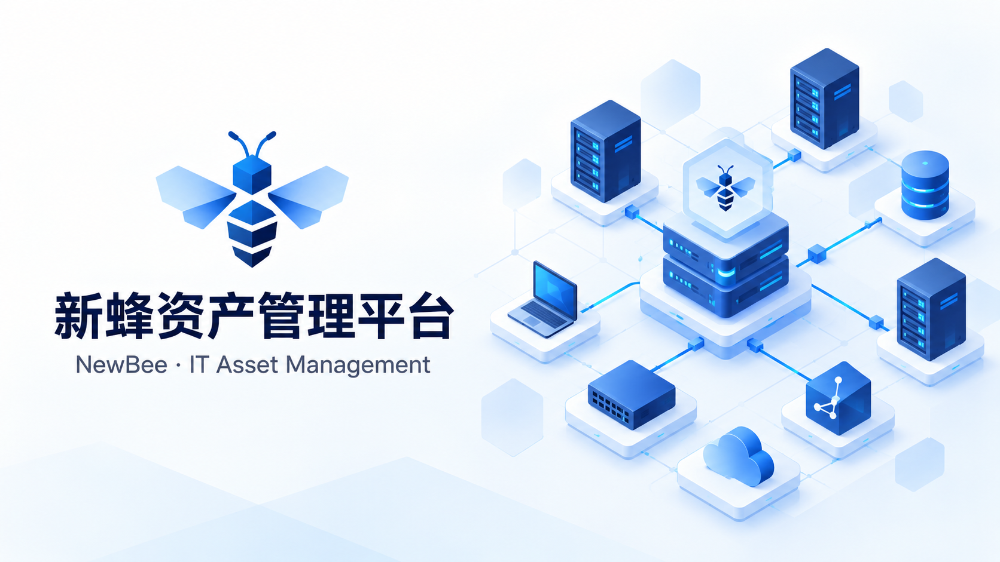

**以资产模型为基础，连接数据采集、配置管理与运维执行。**

新蜂资产管理平台（NewBee）面向 IT 资产管理场景，将资产模型、配置项（CI）、资产关系、统一数据接入和运维任务组织在同一管理入口。系统采用 Vue 3 管理前端与 Go API/RPC 服务架构，通过 Core 提供账号、组织、租户和权限基础能力。

本仓库是平台的开发与部署工作区，通过 Git 子模块固定 **15 个公开仓库**的版本，集中保存部署入口、跨模块文档与开发工具。可从 Core 与前端开始运行，再按需部署 CMDB、统一 IO、运维中心、Proxy、Agent 和 Job。

> 封面为 AI 生成的品牌插画；下方产品截图来自实际运行页面。

[关键功能](#关键功能) · [界面预览](#界面预览) · [获取完整项目](#获取完整项目) · [部署入口](#部署入口) · [许可证与上游](#许可证与上游)

## 关键功能

“已接入”表示当前存在业务接口及对应管理入口；“配套部署”表示需要相应服务、执行节点或外部系统才能完成实际业务。每项能力的适用范围见表内说明。

### 系统、组织与权限

| 功能           | 主要内容                                            | 状态与适用范围                                                                |
| -------------- | --------------------------------------------------- | ----------------------------------------------------------------------------- |
| 账号与认证     | 用户管理、登录认证、验证码、个人资料、密码维护      | 已接入 Core 与前端                                                            |
| 组织管理       | 部门树、岗位、用户与组织关联                        | 已接入                                                                        |
| 角色与访问控制 | 角色、菜单、API 权限及 Casbin 策略                  | 已接入；菜单和接口按授权提供                                                  |
| 数据权限       | 部门和角色关联的数据访问范围，统一中间件与 ORM Hook | 已接入含对应权限字段的业务实体                                                |
| 多租户         | 租户管理、请求上下文传递、业务数据隔离              | 已接入；部分全局任务及指标表不按租户划分                                      |
| 字典与系统参数 | 数据字典、字典明细、运行参数配置                    | 已接入                                                                        |
| Token 管理     | 访问令牌记录与状态管理                              | 已接入                                                                        |
| 审计记录       | 操作、登录及相关审计数据查询                        | 已接入                                                                        |
| OAuth 接入     | 提供商配置、账号绑定、启用状态与提供商统计          | 管理查询已接入；真实登录需配置外部 OAuth 应用；未采集的历史与延迟统计暂不可用 |

### CMDB 资产管理

| 功能           | 主要内容                                                    | 状态与适用范围                                       |
| -------------- | ----------------------------------------------------------- | ---------------------------------------------------- |
| 资产模型与分类 | CI 类型、类型分组、模型字段和属性分组                       | 已接入                                               |
| 属性与数据约束 | 文本、数值、时间、JSON 等属性；选项、必填和唯一性等模型配置 | 存在对应 API/RPC；具体校验以模型配置和后端为准       |
| 模型继承       | 类型继承关系与模型复用接口                                  | 后端接口已提供，按实际模型配置接入                   |
| 资产实例       | 按模型查看、搜索和管理 CI，展示动态属性与实例详情           | 已接入                                               |
| 资产关系       | 关系类型、模型间关系、实例间关联及关系图展示                | 已接入；独立的关系约束扩展页仍待完善                 |
| 资产授权       | 资产与角色权限配置，结合租户和数据范围检查                  | 已接入                                               |
| CI 变更历史    | 按 CI、操作类型及状态查询变更记录                           | 列表已接入；详情、时间线与回滚交互仍有待接入部分     |
| CI 生命周期    | 查询 CI 状态、当前状态、异常及超时标记                      | 列表已接入；详情、时间线和手工状态转换仍有待接入部分 |

### 统一 IO 与数据接入

| 功能           | 主要内容                                           | 状态与适用范围                                        |
| -------------- | -------------------------------------------------- | ----------------------------------------------------- |
| 发现模板       | 查看模板与采集配置定义                             | 已接入查询；实际发现需执行侧配套                      |
| Provider 目录  | Provider 元数据、参数与字段 Schema、类别和启用状态 | 已接入查询；目录记录不等于插件已连接真实资源          |
| 数据目标       | 数据源或目标的类型、连接配置及状态                 | 已接入查询；真实连接需环境配置                        |
| 发现池         | 管理采集范围和发现配置，关联模板与目标             | 管理接口与列表已接入；执行需 IO、Ops 与 Proxy 等配套  |
| 输入任务       | 数据导入任务、执行状态、处理进度和历史记录         | 管理查询已接入；实际采集需启用对应 Worker 与 Provider |
| 输出任务       | 数据输出任务、目标配置及运行记录                   | 管理查询已接入；实际输出需目标系统与执行服务          |
| 字段映射       | 源字段到资产字段的映射配置与转换记录               | 已接入管理与日志查询                                  |
| 配置管理       | IO 配置项及配置审计查询                            | 已接入                                                |
| 任务与映射日志 | 分页查看任务处理日志、字段映射日志                 | 已接入                                                |
| IO 运行指标    | Worker 指标与运行监控页面                          | 已接入查询；WorkerMetrics 属于现有全局表              |
| 周期采集       | 发现和接入相关的周期任务配置                       | 需配套调度服务并显式启用                              |

### 运维、任务与扩展开发

| 功能              | 主要内容                                         | 状态与适用范围                                       |
| ----------------- | ------------------------------------------------ | ---------------------------------------------------- |
| Agent 管理        | 主机 Agent 记录、状态和分组                      | 管理查询已接入；主机采集与执行需单独部署 Linux Agent |
| Proxy 管理        | 网络侧执行节点注册、心跳、在线状态与分组         | 已接入；真实执行需部署并授权 Proxy                   |
| Worker 详情与指标 | Proxy 节点详情、历史指标与节点选择预览           | 已接入只读页面与查询接口；选择预览不会执行任务       |
| 脚本与分类        | 运维脚本、分类、内容及相关元数据管理             | 管理接口与列表已接入                                 |
| 接入配置          | Profile 接入参数及关联资源查询                   | 已接入查询；真实访问需有效目标和凭据                 |
| 会话管理          | 会话记录、关联 Worker、状态及历史查询            | 查询已接入；交互连接需协议插件和目标环境             |
| 运维任务          | 任务记录、状态、结果与执行节点关联               | 查询已接入；真实调度需在线执行节点                   |
| 远程协议与插件    | Proxy 的 SSH、RDP 等插件及执行器代码             | 配套部署；各协议须在目标环境单独联调                 |
| 定时任务          | 基于 Asynq 的任务配置、周期调度及执行日志        | 需部署 Job、Redis 并配置调用方                       |
| 资产选择 SDK      | Vue 资产选择组件、组合式 API、配置构建与服务适配 | 提供独立源码包；需宿主应用对接 CMDB 和认证           |
| 公共基础库        | 认证、租户、数据权限、审计、配置和 ORM 集成      | 各服务共享库，不是独立进程                           |
| 服务开发模板      | Go API/RPC、Ent 与权限接入骨架                   | 开发模板；替换占位符并生成代码后使用                 |

### 当前界面边界

| 页面或资源                                 | 当前范围                                                                       |
| ------------------------------------------ | ------------------------------------------------------------------------------ |
| 工作台与分析模板                           | 工作台保留部分 Vben 示例卡片、图表和内容，不作为真实资产统计大盘               |
| CI 关系约束与测试页                        | 独立的关系约束扩展页仍待完善                                                   |
| CI 变更与生命周期扩展操作                  | 列表已连接真实记录；详情、时间线、回滚及状态转换不能仅凭按钮或提示视为完成     |
| IPAM、工作流、文件存储及代码生成等前端目录 | 保留相关页面或集成代码；本工作区不包含所有配套后端，不列为已完整交付的平台业务 |
| 历史部署与设计文档                         | 部分为上游模板或阶段性设计；部署以各模块当前 README、入口与配置为准            |

## 界面预览

以下 17 张截图于 2026 年 10 月 6 日采集自本机运行的管理页面。

### 01 · IO Worker 监控

IO Worker 的 CPU、内存、任务数与心跳记录。

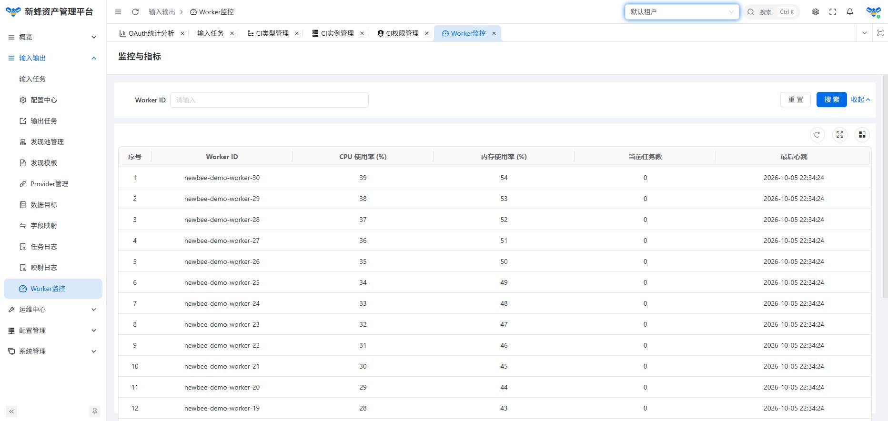

### 02 · 资产模型

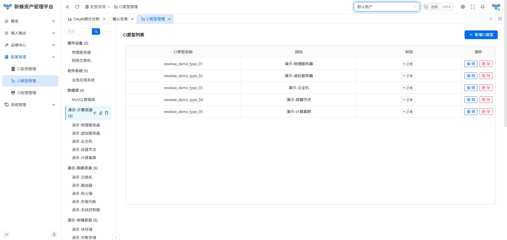

### 03 · 资产实例

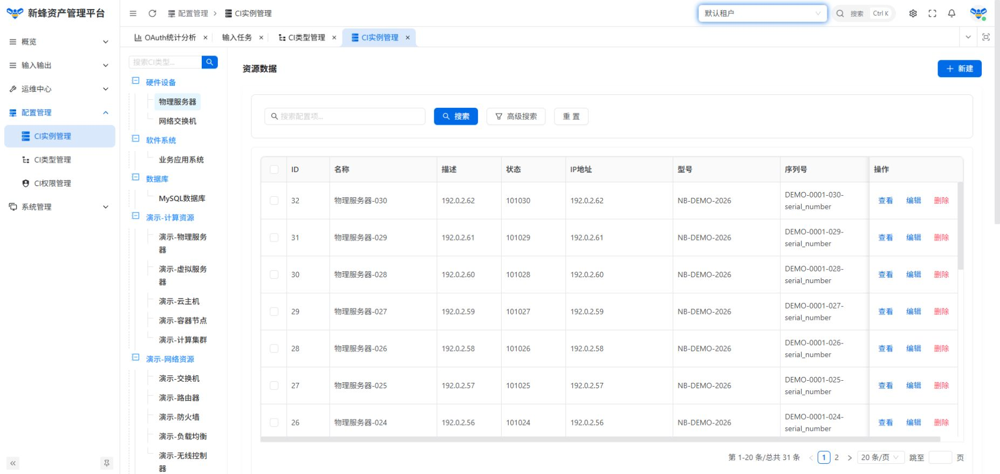

### 04 · 资产权限

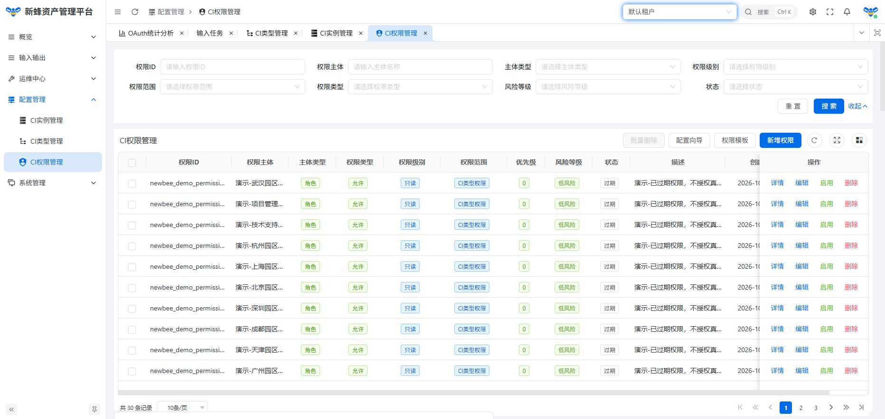

### 05 · 发现池

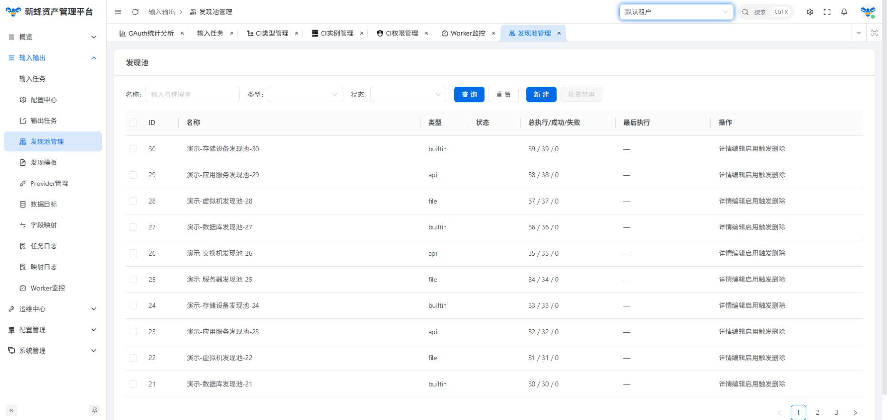

### 06 · 输入任务

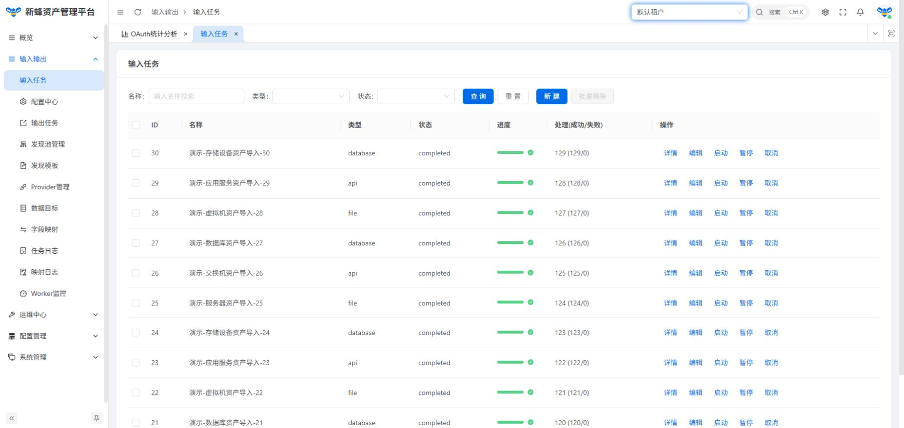

### 07 · 输出任务

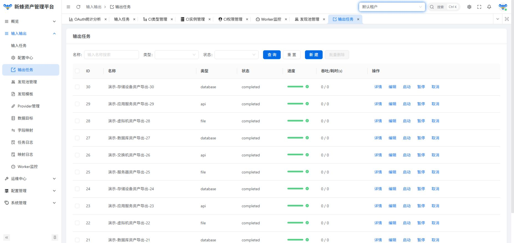

### 08 · 字段映射

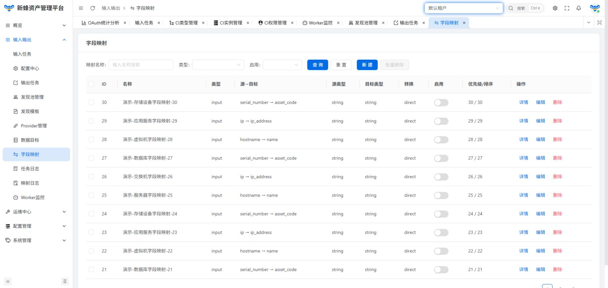

### 09 · Provider 目录

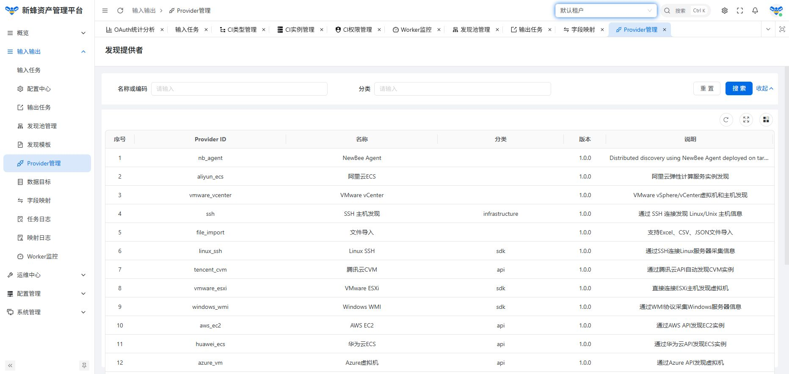

### 10 · 数据目标

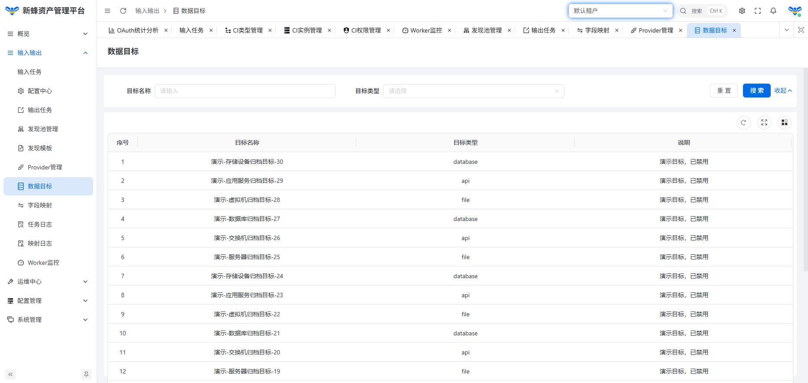

### 11 · Proxy 节点

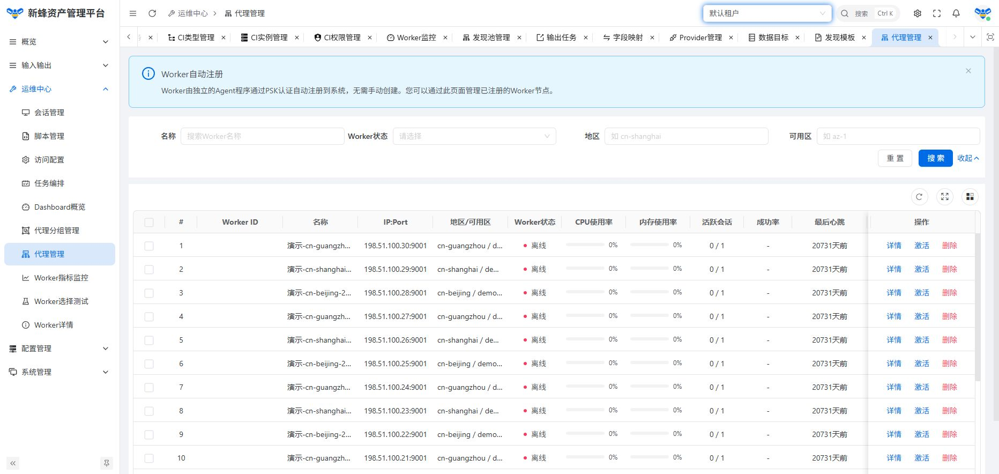

### 12 · 运维 Worker 指标

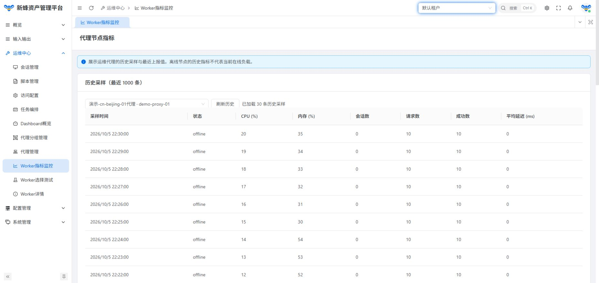

### 13 · 运维脚本

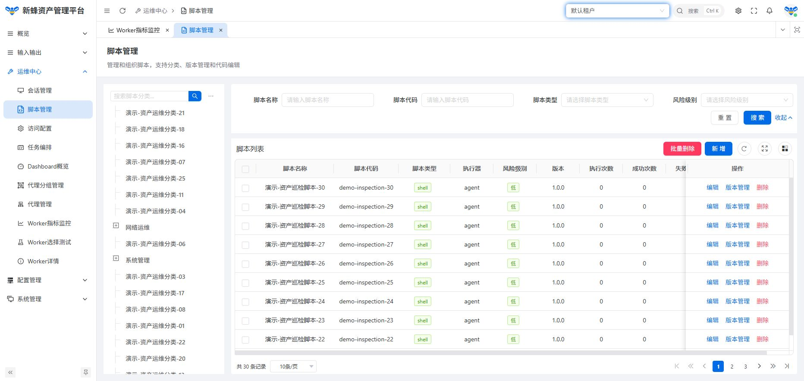

### 14 · 用户管理

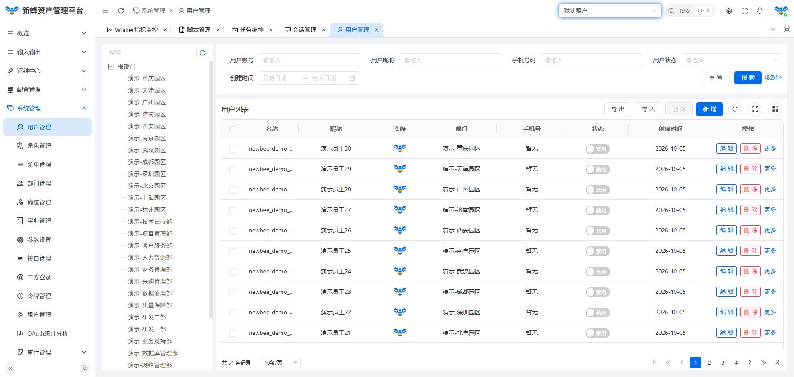

### 15 · 角色权限

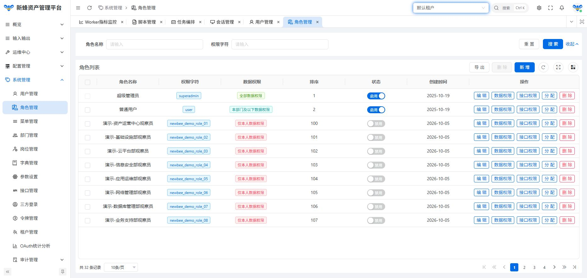

### 16 · OAuth 统计

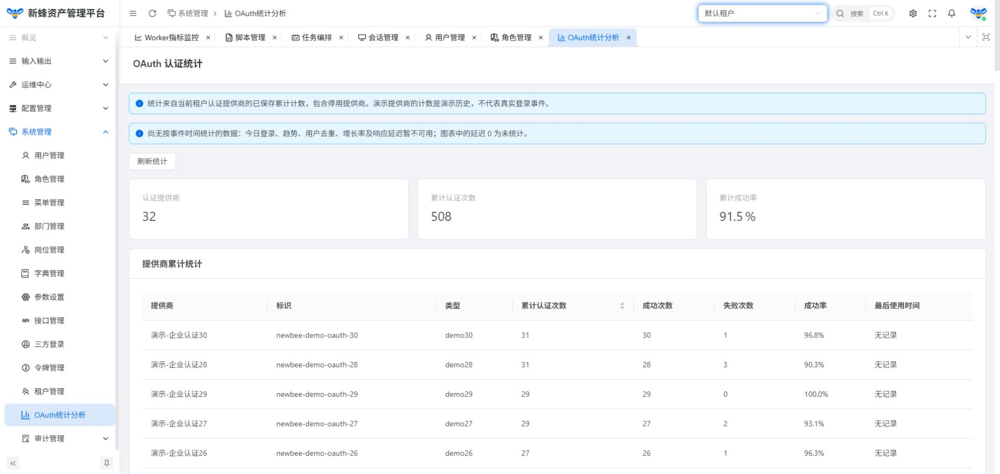

### 17 · 发现模板

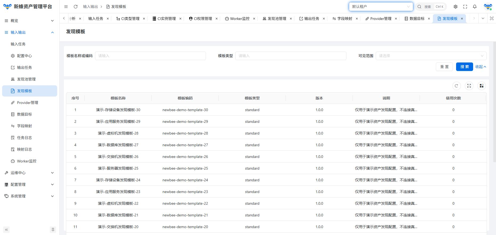

## 获取完整项目

所有在用代码仓库均公开。建议递归克隆工作区，保持 `go.work` 和各服务的本地依赖路径一致：

```sh
git clone --recurse-submodules https://github.com/coder-lulu/newbee.git
cd newbee
git submodule update --init --recursive
```

已有工作区更新到本仓库记录的版本：

```sh
git pull --ff-only
git submodule update --init --recursive
```

各子模块有独立仓库与许可证。单独克隆后端模块时，需要按其 README 准备同级依赖；本工作区内的 `replace` 路径和 `go.work` 以完整目录布局为基础。

## 仓库与模块

| 本地路径                      | 仓库                                                                                 | 用途                                 | 文档                                                                           |
| ----------------------------- | ------------------------------------------------------------------------------------ | ------------------------------------ | ------------------------------------------------------------------------------ |
| `.`                           | [newbee](https://github.com/coder-lulu/newbee)                                       | 平台工作区与跨模块资料               | 本文                                                                           |
| `ui`                          | [newbee-ui](https://github.com/coder-lulu/newbee-ui)                                 | Web 管理前端                         | [前端与部署](https://github.com/coder-lulu/newbee-ui#readme)                   |
| `core`                        | [newbee-core](https://github.com/coder-lulu/newbee-core)                             | 用户、组织、租户、权限及系统基础服务 | [核心服务与部署](https://github.com/coder-lulu/newbee-core#readme)             |
| `common`                      | [newbee-common](https://github.com/coder-lulu/newbee-common)                         | 通用配置、中间件、数据权限与工具     | [公共库](https://github.com/coder-lulu/newbee-common#readme)                   |
| `cmdb/api`                    | [newbee-cmdb-api](https://github.com/coder-lulu/newbee-cmdb-api)                     | 资产管理 HTTP API                    | [CMDB API](https://github.com/coder-lulu/newbee-cmdb-api#readme)               |
| `cmdb/rpc`                    | [newbee-cmdb-rpc](https://github.com/coder-lulu/newbee-cmdb-rpc)                     | 资产模型、实例、关系及发现服务       | [CMDB RPC](https://github.com/coder-lulu/newbee-cmdb-rpc#readme)               |
| `ops-center`                  | [newbee-ops](https://github.com/coder-lulu/newbee-ops)                               | 运维任务与执行调度                   | [运维中心](https://github.com/coder-lulu/newbee-ops#readme)                    |
| `unified-io`                  | [newbee-io](https://github.com/coder-lulu/newbee-io)                                 | IO provider 与统一接入工作区         | [统一 IO](https://github.com/coder-lulu/newbee-io#readme)                      |
| `unified-io/api`              | [newbee-io-api](https://github.com/coder-lulu/newbee-io-api)                         | 统一接入 HTTP API                    | [IO API](https://github.com/coder-lulu/newbee-io-api#readme)                   |
| `unified-io/rpc`              | [newbee-io-rpc](https://github.com/coder-lulu/newbee-io-rpc)                         | IO 配置、采集与后台任务服务          | [IO RPC](https://github.com/coder-lulu/newbee-io-rpc#readme)                   |
| `nb-agent`                    | [nb-agent](https://github.com/coder-lulu/nb-agent)                                   | 主机侧 Agent 与主机信息接入          | [Agent](https://github.com/coder-lulu/nb-agent#readme)                         |
| `newbee-proxy`                | [newbee-proxy](https://github.com/coder-lulu/newbee-proxy)                           | 协议代理、远程连接和任务执行         | [Proxy](https://github.com/coder-lulu/newbee-proxy#readme)                     |
| `job`                         | [newbee-job](https://github.com/coder-lulu/newbee-job)                               | 定时与异步任务服务                   | [任务服务](https://github.com/coder-lulu/newbee-job#readme)                    |
| `packages/asset-selector-sdk` | [newbee-asset-selector-sdk](https://github.com/coder-lulu/newbee-asset-selector-sdk) | Vue 资产选择组件与 SDK               | [资产选择 SDK](https://github.com/coder-lulu/newbee-asset-selector-sdk#readme) |
| `templates/service-template`  | [newbee-service-template](https://github.com/coder-lulu/newbee-service-template)     | API/RPC 服务开发模板                 | [服务模板](https://github.com/coder-lulu/newbee-service-template#readme)       |

根工作区包含 12 个直接子模块，`unified-io` 再管理 API、RPC 两个子模块，共对应 15 个在用仓库。

## 部署入口

先完成核心服务与前端部署，再按需要接入资产、采集和运维服务。仅启动核心与前端可验证系统基础功能；资产与运维页面需要相应后端服务。

| 组件       | 准备内容                                                               | 部署说明                                                                                                                           |
| ---------- | ---------------------------------------------------------------------- | ---------------------------------------------------------------------------------------------------------------------------------- |
| 核心服务   | Go 1.25.1+、数据库、Redis；配置 RPC/API 并首次初始化数据库             | [配置、初始化、构建与 Linux 部署](https://github.com/coder-lulu/newbee-core#readme)                                                |
| Web 前端   | Node.js 20.10.0+、项目指定的 pnpm 10.10.0；配置 API 地址并构建静态文件 | [开发、生产构建与 Nginx 部署](https://github.com/coder-lulu/newbee-ui#readme)                                                      |
| 资产管理   | CMDB RPC/API 及其数据库配置，与核心权限服务连接                        | [CMDB RPC](https://github.com/coder-lulu/newbee-cmdb-rpc#readme)、[CMDB API](https://github.com/coder-lulu/newbee-cmdb-api#readme) |
| 采集与运维 | 按功能启用 IO、Agent、Proxy、运维中心或 Job                            | 上表中对应模块 README                                                                                                              |

当前核心配置示例中，RPC 监听 `9100`、API 监听 `9101`。前端使用 `/sys-api` 接口前缀，开发代理或生产反向代理需要剥离该前缀，再转发到核心 API。前端启动端口以应用配置和终端输出为准。

核心服务首次部署顺序为：准备数据库与 Redis → 配置并启动 Core RPC → 初始化数据库 → 启动 Core API → 部署前端。完整命令及初始化接口见核心 README。

完整平台从空 MySQL 数据库开始部署的配置、编译、初始化顺序和前端镜像命令见 [空库部署说明](docs/deployment.md)。平台提供建表及基础数据初始化代码，不需要导入维护者本机的数据库备份。

## 配置与开发约定

- 真实服务配置保留在本机。将服务的 `*.yaml.example` 复制为同名 `*.yaml` 后，修改数据库、Redis、服务地址与密钥。模板中的地址和占位符需要按实际环境填写。
- 只有启用 `conf.UseEnv()` 的服务入口才会展开配置中的环境变量；其他服务须先将占位符替换为配置值，具体以模块 README 为准。
- 前端环境文件应放在实际应用目录，具体加载位置及生产配置方式见前端 README。本地私密覆盖文件使用 `.env.local` 或 `.env.<mode>.local`。
- Go 服务使用根目录 `go.work` 协调本地模块。进入各模块目录执行其构建或测试命令；Agent、前端和 SDK 的独立工具链见各自文档。
- `init-databases.sh`、`start_service.sh` 面向 Bash 环境；使用前核对服务地址与目录映射。首次核心初始化优先使用核心 README 中的明确步骤。
- 编译产物、数据库运行文件、私钥、依赖缓存和本地日志不提交。诊断产物统一写入 `logs/`。

## 延伸阅读

- [平台架构设计](架构设计.md)
- [资产类型自动发现设计](CIType_Auto_Discovery_Design.md)
- [数据库初始化工具说明](INIT_DATABASES_README.md)
- [仓库开发约定](AGENTS.md)
- [服务模板说明](templates/README.md)

## 许可证与上游

本工作区自身内容使用 [MIT](LICENSE)。各子仓库保留独立许可证；上游来源与版权声明见对应仓库 README 和 LICENSE。

| 许可证       | 仓库                                                                                                                                                          |
| ------------ | ------------------------------------------------------------------------------------------------------------------------------------------------------------- |
| MIT          | `newbee`、`newbee-ui`、`newbee-proxy`、`newbee-io`、`newbee-asset-selector-sdk`                                                                               |
| Apache-2.0   | `newbee-core`、`newbee-common`、`newbee-ops`、`newbee-cmdb-api`、`newbee-cmdb-rpc`、`newbee-io-api`、`newbee-io-rpc`、`newbee-job`、`newbee-service-template` |
| BSD-3-Clause | `nb-agent`                                                                                                                                                    |

核心服务、公共库和任务服务分别保留 Simple Admin 相关上游的 Apache 2.0 授权；前端保留 Vben 的 MIT 授权；Agent 保留 AcePanel 的 BSD 3-Clause 授权。第三方依赖与保留的源码声明遵循各自许可证。
