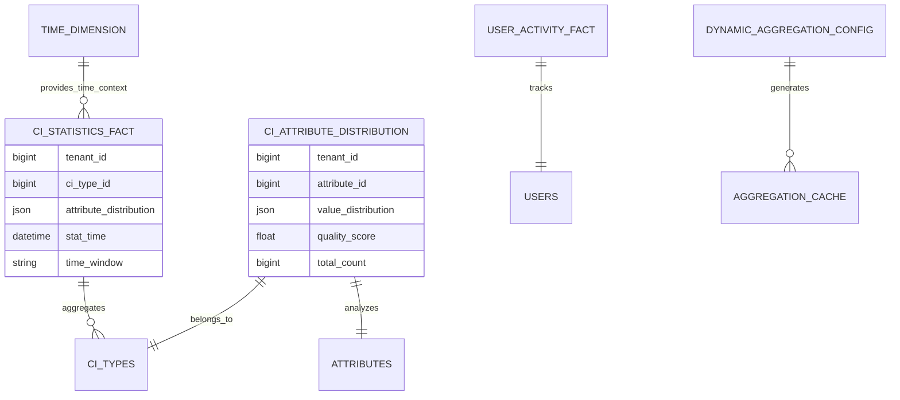

# NewBee CMDB 统计分析系统设计文档

## 概述

基于NewBee CMDB的EAV动态属性模式和多租户架构，设计了一个完整的统计分析系统，支持动态字段配置、多维度分析、实时图表展示、数据钻取等功能。

## 1. 系统架构设计

### 1.1 整体架构

```
┌─────────────────────────────────────────────────────────────┐
│                    前端展示层                                 │
│  ┌──────────────┐ ┌──────────────┐ ┌──────────────┐        │
│  │ 统计仪表板   │ │ 动态字段选择 │ │ 多维度分析   │        │
│  └──────────────┘ └──────────────┘ └──────────────┘        │
│  ┌──────────────┐ ┌──────────────┐ ┌──────────────┐        │
│  │ 图表渲染器   │ │ 过滤面板     │ │ 权限管理     │        │
│  └──────────────┘ └──────────────┘ └──────────────┘        │
└─────────────────────────────────────────────────────────────┘
                            │
                            │ HTTP/WebSocket
                            ▼
┌─────────────────────────────────────────────────────────────┐
│                    API服务层                                 │
│  ┌──────────────┐ ┌──────────────┐ ┌──────────────┐        │
│  │ 统计查询API  │ │ 字段元数据API│ │ 配置管理API  │        │
│  └──────────────┘ └──────────────┘ └──────────────┘        │
│  ┌──────────────┐ ┌──────────────┐ ┌──────────────┐        │
│  │ 缓存管理API  │ │ 权限验证API  │ │ 导出服务API  │        │
│  └──────────────┘ └──────────────┘ └──────────────┘        │
└─────────────────────────────────────────────────────────────┘
                            │
                            │ SQL/Cache
                            ▼
┌─────────────────────────────────────────────────────────────┐
│                    数据存储层                                 │
│  ┌──────────────┐ ┌──────────────┐ ┌──────────────┐        │
│  │ MySQL主库    │ │ 读写分离     │ │ 分片路由     │        │
│  └──────────────┘ └──────────────┘ └──────────────┘        │
│  ┌──────────────┐ ┌──────────────┐ ┌──────────────┐        │
│  │ Redis缓存    │ │ 时间序列DB   │ │ 归档存储     │        │
│  └──────────────┘ └──────────────┘ └──────────────┘        │
└─────────────────────────────────────────────────────────────┘
```

### 1.2 技术栈选择

**前端技术栈：**
- React 18 + TypeScript - 现代化组件开发
- Ant Design 5.0 - 企业级UI组件库
- ECharts 5.0 - 专业图表库
- Redux Toolkit - 状态管理
- React Grid Layout - 响应式拖拽布局
- Tailwind CSS - 原子化CSS框架

**后端技术栈：**
- Go + Go-Zero - 高性能微服务框架
- Ent ORM - 类型安全的ORM框架
- MySQL 8.0+ - 主数据库（支持JSON、分区等特性）
- Redis 6.0+ - 缓存和会话存储
- InfluxDB - 时间序列数据存储（可选）

## 2. 数据模型设计

### 2.1 核心统计表结构

#### 2.1.1 CI统计事实表 (ci_statistics_fact)
```sql
CREATE TABLE cmdb_ci_statistics_fact (
    id BIGINT PRIMARY KEY,
    tenant_id BIGINT NOT NULL,
    department_id BIGINT,
    ci_type_id BIGINT NOT NULL,
    ci_count BIGINT DEFAULT 0,
    attribute_distribution JSON, -- 属性分布统计
    relation_metrics JSON,       -- 关系统计指标
    lifecycle_stage ENUM('development', 'testing', 'staging', 'production', 'retired'),
    status_distribution JSON,    -- 状态分布统计
    time_window ENUM('hourly', 'daily', 'weekly', 'monthly', 'yearly'),
    stat_time DATETIME NOT NULL,
    version BIGINT DEFAULT 1,
    INDEX idx_tenant_type_time (tenant_id, ci_type_id, stat_time)
);
```

#### 2.1.2 属性分布表 (ci_attribute_distribution)
```sql
CREATE TABLE cmdb_ci_attribute_distribution (
    id BIGINT PRIMARY KEY,
    tenant_id BIGINT NOT NULL,
    ci_type_id BIGINT NOT NULL,
    attribute_id BIGINT NOT NULL,
    attribute_name VARCHAR(128),
    value_type ENUM('text', 'integer', 'float', 'datetime', 'json', 'boolean'),
    value_distribution JSON,     -- 值分布详情
    quality_score FLOAT DEFAULT 0.0, -- 数据质量评分
    total_count BIGINT DEFAULT 0,
    unique_count BIGINT DEFAULT 0,
    last_analyzed_at DATETIME DEFAULT NOW(),
    UNIQUE KEY uk_tenant_type_attr (tenant_id, ci_type_id, attribute_id)
);
```

#### 2.1.3 时间维度表 (time_dimension)
```sql
CREATE TABLE cmdb_time_dimension (
    id BIGINT PRIMARY KEY,
    tenant_id BIGINT NOT NULL,
    date_time DATETIME NOT NULL,
    year INT, quarter INT, month INT, week_of_year INT,
    day_of_month INT, hour INT, minute INT,
    is_weekday BOOLEAN, is_holiday BOOLEAN,
    timezone VARCHAR(32) DEFAULT 'Asia/Shanghai',
    UNIQUE KEY uk_tenant_datetime (tenant_id, date_time)
);
```

#### 2.1.4 用户活动事实表 (user_activity_fact)
```sql
CREATE TABLE cmdb_user_activity_fact (
    id BIGINT PRIMARY KEY,
    tenant_id BIGINT NOT NULL,
    user_id BIGINT NOT NULL,
    operation_type ENUM('create', 'read', 'update', 'delete', 'batch_update', 'export'),
    resource_type VARCHAR(64),   -- ci, ci_type, attribute等
    resource_id BIGINT,
    operation_time DATETIME DEFAULT NOW(),
    response_time_ms BIGINT,     -- 响应时间
    status ENUM('success', 'failed', 'partial'),
    INDEX idx_tenant_user_time (tenant_id, user_id, operation_time)
);
```

#### 2.1.5 动态聚合配置表 (dynamic_aggregation_config)
```sql
CREATE TABLE cmdb_dynamic_aggregation_config (
    id BIGINT PRIMARY KEY,
    tenant_id BIGINT NOT NULL,
    config_name VARCHAR(128) NOT NULL,
    config_type ENUM('dashboard', 'report', 'alert', 'custom'),
    data_sources JSON,           -- 数据源配置
    dimensions JSON,             -- 维度配置
    measures JSON,               -- 度量配置
    filters JSON,                -- 过滤条件
    chart_config JSON,           -- 图表配置
    cache_enabled BOOLEAN DEFAULT TRUE,
    share_level ENUM('private', 'department', 'tenant', 'public'),
    UNIQUE KEY uk_tenant_name (tenant_id, config_name)
);
```

#### 2.1.6 聚合缓存表 (aggregation_cache)
```sql
CREATE TABLE cmdb_aggregation_cache (
    id BIGINT PRIMARY KEY,
    tenant_id BIGINT NOT NULL,
    config_id BIGINT NOT NULL,
    cache_key VARCHAR(512) NOT NULL,
    params_hash VARCHAR(64),     -- 查询参数MD5哈希
    aggregation_result JSON,     -- 聚合结果
    expires_at DATETIME NOT NULL,
    access_count BIGINT DEFAULT 0,
    cache_size_bytes BIGINT,
    UNIQUE KEY uk_tenant_key (tenant_id, cache_key),
    INDEX idx_expires_at (expires_at)
);
```

### 2.2 数据模型关系图



## 3. 前端组件设计

### 3.1 组件层次结构

```
StatisticsDashboard (主仪表板)
├── DynamicFieldSelector (动态字段选择器)
│   ├── FieldTree (字段树)
│   ├── QualityIndicator (质量指标)
│   └── AttributeDetails (属性详情)
├── MultiDimensionAnalysis (多维度分析)
│   ├── DimensionConfig (维度配置)
│   ├── MeasureConfig (指标配置)
│   └── FilterBuilder (过滤器构建)
├── ChartRenderer (图表渲染器)
│   ├── EChartsWrapper (ECharts包装器)
│   ├── TableRenderer (表格渲染器)
│   └── MetricCard (指标卡片)
├── FilterPanel (过滤面板)
│   ├── AttributeFilter (属性过滤器)
│   ├── TimeRangeFilter (时间范围过滤)
│   └── RelationFilter (关系过滤器)
└── ResponsiveLayout (响应式布局)
    ├── GridLayout (网格布局)
    └── MobileLayout (移动端布局)
```

### 3.2 核心组件设计

#### 3.2.1 StatisticsDashboard
- **功能**：主仪表板，统一管理所有统计组件
- **特性**：响应式布局、拖拽调整、全屏显示
- **状态管理**：使用Redux管理全局状态

#### 3.2.2 DynamicFieldSelector
- **功能**：基于EAV模式的动态字段选择
- **特性**：树形结构、搜索过滤、质量评分展示
- **数据源**：从多个value表聚合字段元数据

#### 3.2.3 ChartRenderer
- **功能**：统一的图表渲染组件
- **支持类型**：柱状图、折线图、饼图、表格、热力图等
- **特性**：主题切换、交互钻取、数据导出

## 4. 后端服务设计

### 4.1 API接口设计

#### 4.1.1 统计查询接口
```go
// POST /api/v1/cmdb/statistics/query
type StatisticsQueryRequest struct {
    Config       StatisticsQueryConfig `json:"config"`
    ForceRefresh bool                   `json:"forceRefresh,optional"`
    DebugMode    bool                   `json:"debugMode,optional"`
}

type StatisticsQueryResponse struct {
    Success       bool                   `json:"success"`
    Data          StatisticsResultData   `json:"data"`
    Pagination    *PaginationInfo        `json:"pagination,optional"`
    Metadata      ResultMetadata         `json:"metadata"`
    CacheInfo     *CacheInfo             `json:"cacheInfo,optional"`
    ExecutionTime int64                  `json:"executionTime"` // 毫秒
}
```

#### 4.1.2 字段元数据接口
```go
// POST /api/v1/cmdb/statistics/fields/metadata
type FieldMetadataRequest struct {
    CiTypeIds         []uint64 `json:"ciTypeIds"`
    IncludeAttributes bool     `json:"includeAttributes,optional"`
    IncludeRelations  bool     `json:"includeRelations,optional"`
}

type FieldMetadataResponse struct {
    Fields  []FieldMetadata `json:"fields"`
    CiTypes []CIType        `json:"ciTypes"`
}
```

### 4.2 查询引擎设计

#### 4.2.1 EAV查询优化
```go
// EAV模式的高效查询构建
func (s *StatisticsService) buildEAVQuery(config *StatisticsQueryConfig) (*sql.Query, error) {
    var joins []string
    var selects []string
    var wheres []string
    
    // 基础表查询
    selects = append(selects, "c.id, c.tenant_id, c.type_id, c.created_at")
    baseQuery := "FROM cmdb_cis c"
    
    // 动态属性JOIN
    for _, dim := range config.Dimensions {
        if dim.Type == "attribute" {
            attrId := extractAttributeId(dim.Field)
            alias := fmt.Sprintf("attr_%d", attrId)
            
            switch dim.DataType {
            case "text":
                joins = append(joins, fmt.Sprintf(
                    "LEFT JOIN cmdb_value_texts %s ON c.id = %s.ci_id AND %s.attr_id = %d",
                    alias, alias, alias, attrId))
                selects = append(selects, fmt.Sprintf("%s.value as %s", alias, dim.Alias))
            case "integer":
                joins = append(joins, fmt.Sprintf(
                    "LEFT JOIN cmdb_value_integers %s ON c.id = %s.ci_id AND %s.attr_id = %d",
                    alias, alias, alias, attrId))
                selects = append(selects, fmt.Sprintf("%s.value as %s", alias, dim.Alias))
            // ... 其他类型
            }
        }
    }
    
    // 构建完整查询
    query := fmt.Sprintf("SELECT %s %s %s", 
        strings.Join(selects, ", "),
        baseQuery,
        strings.Join(joins, " "))
    
    return s.DB.Raw(query), nil
}
```

#### 4.2.2 缓存策略实现
```go
type CacheManager struct {
    L1Cache *ristretto.Cache  // 内存缓存
    L2Cache *redis.Client     // Redis缓存
    L3DB    *ent.Client       // 数据库持久化缓存
}

func (cm *CacheManager) GetOrCompute(key string, computer func() (interface{}, error)) (interface{}, error) {
    // L1: 内存缓存
    if value, found := cm.L1Cache.Get(key); found {
        return value, nil
    }
    
    // L2: Redis缓存
    if value, err := cm.L2Cache.Get(context.Background(), key).Result(); err == nil {
        var result interface{}
        if err := json.Unmarshal([]byte(value), &result); err == nil {
            cm.L1Cache.Set(key, result, 1)
            return result, nil
        }
    }
    
    // L3: 数据库缓存
    if cache, err := cm.L3DB.AggregationCache.Query().
        Where(aggregationcache.CacheKeyEQ(key)).
        Where(aggregationcache.ExpiresAtGT(time.Now())).
        First(context.Background()); err == nil {
        
        var result interface{}
        if err := json.Unmarshal(cache.AggregationResult, &result); err == nil {
            // 回填上级缓存
            cm.L2Cache.Set(context.Background(), key, string(cache.AggregationResult), time.Until(cache.ExpiresAt))
            cm.L1Cache.Set(key, result, 1)
            return result, nil
        }
    }
    
    // 计算新值
    result, err := computer()
    if err != nil {
        return nil, err
    }
    
    // 写入各级缓存
    cm.writeCache(key, result)
    return result, nil
}
```

## 5. 权限控制设计

### 5.1 多级权限隔离

```go
type PermissionContext struct {
    TenantId     uint64   `json:"tenantId"`
    DepartmentId uint64   `json:"departmentId"`
    UserId       uint64   `json:"userId"`
    Roles        []string `json:"roles"`
    DataScope    DataScope `json:"dataScope"`
}

type DataScope struct {
    Level         string    `json:"level"` // all, department, self, custom
    DepartmentIds []uint64  `json:"departmentIds,optional"`
    UserIds       []uint64  `json:"userIds,optional"`
    CustomFilters []FilterCondition `json:"customFilters,optional"`
}

// 权限过滤器
func (s *StatisticsService) ApplyPermissionFilters(
    ctx context.Context, 
    query *ent.Query, 
    perm *PermissionContext,
) *ent.Query {
    // 租户隔离（自动应用）
    query = query.Where(ci.TenantIdEQ(perm.TenantId))
    
    // 数据权限隔离
    switch perm.DataScope.Level {
    case "all":
        // 无额外限制
    case "department":
        query = query.Where(ci.DepartmentIdEQ(perm.DepartmentId))
    case "self":
        query = query.Where(ci.CreatedByEQ(perm.UserId))
    case "custom":
        // 应用自定义过滤条件
        for _, filter := range perm.DataScope.CustomFilters {
            query = s.applyFilter(query, filter)
        }
    }
    
    return query
}
```

## 6. 性能优化策略

### 6.1 数据库优化

#### 6.1.1 索引策略
```sql
-- 租户+类型+时间组合索引
CREATE INDEX idx_statistics_tenant_type_time 
ON cmdb_ci_statistics_fact (tenant_id, ci_type_id, stat_time DESC);

-- 属性分布查询索引
CREATE INDEX idx_attr_dist_tenant_type_attr 
ON cmdb_ci_attribute_distribution (tenant_id, ci_type_id, attribute_id);

-- EAV表的复合索引
CREATE INDEX idx_value_texts_tenant_ci_attr 
ON cmdb_value_texts (tenant_id, ci_id, attr_id);

-- 缓存过期时间索引
CREATE INDEX idx_cache_expires_at 
ON cmdb_aggregation_cache (expires_at);
```

#### 6.1.2 分片策略
```go
type ShardRouter struct {
    ShardCount int
    HashFunc   func(tenantId uint64) int
}

func (sr *ShardRouter) GetShardId(tenantId uint64) int {
    return int(tenantId % uint64(sr.ShardCount))
}

func (sr *ShardRouter) GetTableName(baseTable string, tenantId uint64) string {
    shardId := sr.GetShardId(tenantId)
    return fmt.Sprintf("%s_shard_%d", baseTable, shardId)
}
```

### 6.2 查询优化

#### 6.2.1 预聚合计算
```go
// 定时任务：预计算常用统计
func (s *StatisticsService) PreAggregateCommonMetrics() error {
    configs := s.getCommonAggregationConfigs()
    
    for _, config := range configs {
        go func(cfg *DynamicAggregationConfig) {
            if result, err := s.ExecuteQuery(cfg); err == nil {
                s.CacheManager.Set(cfg.GetCacheKey(), result, cfg.CacheTTL)
            }
        }(config)
    }
    
    return nil
}
```

#### 6.2.2 批量查询优化
```go
// 批量查询多个统计配置
func (s *StatisticsService) ExecuteBatchQueries(
    configs []*StatisticsQueryConfig,
) (map[string]*StatisticsQueryResult, error) {
    results := make(map[string]*StatisticsQueryResult)
    var wg sync.WaitGroup
    var mu sync.Mutex
    
    semaphore := make(chan struct{}, 5) // 限制并发数
    
    for _, config := range configs {
        wg.Add(1)
        go func(cfg *StatisticsQueryConfig) {
            defer wg.Done()
            semaphore <- struct{}{}
            defer func() { <-semaphore }()
            
            if result, err := s.ExecuteQuery(cfg); err == nil {
                mu.Lock()
                results[cfg.Name] = result
                mu.Unlock()
            }
        }(config)
    }
    
    wg.Wait()
    return results, nil
}
```

## 7. 部署和监控

### 7.1 部署架构

```yaml
# docker-compose.yml
version: '3.8'
services:
  cmdb-statistics-api:
    image: newbee/cmdb-statistics:latest
    replicas: 3
    environment:
      - DB_HOST=mysql-master
      - REDIS_HOST=redis-cluster
      - CACHE_ENABLED=true
    
  mysql-master:
    image: mysql:8.0
    environment:
      - MYSQL_ROOT_PASSWORD=***
    volumes:
      - ./mysql/master:/var/lib/mysql
    
  mysql-slave:
    image: mysql:8.0
    depends_on:
      - mysql-master
    
  redis-cluster:
    image: redis:6.2-alpine
    command: redis-server --cluster-enabled yes
    
  nginx:
    image: nginx:alpine
    ports:
      - "80:80"
      - "443:443"
```

### 7.2 监控指标

```go
// 性能监控指标
type StatisticsMetrics struct {
    // 查询性能
    QueryDuration        *prometheus.HistogramVec
    QueryErrors          *prometheus.CounterVec
    ConcurrentQueries    *prometheus.GaugeVec
    
    // 缓存性能
    CacheHitRate         *prometheus.GaugeVec
    CacheSize            *prometheus.GaugeVec
    CacheEvictions       *prometheus.CounterVec
    
    // 数据库性能
    DBConnectionPool     *prometheus.GaugeVec
    SlowQueries          *prometheus.CounterVec
    DBLockWaitTime       *prometheus.HistogramVec
    
    // 业务指标
    ActiveUsers          *prometheus.GaugeVec
    StatisticsGenerated  *prometheus.CounterVec
    DataQualityScore     *prometheus.GaugeVec
}
```

## 8. 扩展性设计

### 8.1 插件化架构

```go
// 统计插件接口
type StatisticsPlugin interface {
    Name() string
    Version() string
    SupportedChartTypes() []string
    Execute(config *StatisticsQueryConfig) (*StatisticsQueryResult, error)
    Validate(config *StatisticsQueryConfig) error
}

// 插件注册器
type PluginRegistry struct {
    plugins map[string]StatisticsPlugin
}

func (pr *PluginRegistry) Register(plugin StatisticsPlugin) {
    pr.plugins[plugin.Name()] = plugin
}

// 自定义图表类型插件
type CustomChartPlugin struct {
    chartType string
    renderer  ChartRenderer
}

func (cp *CustomChartPlugin) Execute(config *StatisticsQueryConfig) (*StatisticsQueryResult, error) {
    // 自定义图表渲染逻辑
    return cp.renderer.Render(config)
}
```

### 8.2 API扩展机制

```go
// REST API扩展
type APIExtension interface {
    Routes() []Route
    Middleware() []gin.HandlerFunc
    Initialize(app *gin.Engine) error
}

// GraphQL扩展支持
type GraphQLResolver struct {
    StatisticsService *StatisticsService
}

func (r *GraphQLResolver) Statistics(ctx context.Context, args struct {
    Config StatisticsQueryConfig
}) (*StatisticsQueryResult, error) {
    return r.StatisticsService.ExecuteQuery(&args.Config)
}
```

## 9. 安全考虑

### 9.1 数据安全
- SQL注入防护：使用参数化查询
- 敏感数据脱敏：统计结果中的敏感字段自动脱敏
- 查询权限验证：基于角色的细粒度权限控制

### 9.2 系统安全
- 资源限制：限制单次查询的数据量和复杂度
- 频率限制：防止恶意高频查询
- 审计日志：记录所有统计查询操作

### 9.3 多租户字段约束与审计基线（2025-02）
- **租户/部门字段**：CMDB RPC 层已为所有 ent schema 挂载 `TenantMixin` + `DepartmentMixin`，消除初始化阶段的 `SetDepartmentID` 反射失败并确保统计数据按租户/部门隔离。
- **创建者字段**：统一复用 `mixins.CreatedByMixin`（现已 `Optional + Nillable`），保障审计与变更追踪链路保持 UUID 语义。
- **例外说明**：`cmdb_ci_permissions`、`cmdb_permission_templates` 仍保留字符串创建人字段，原因是与现有权限模板导入/分发协议共用同一结构；对应请求会同时落盘 `created_by_name` 并在统一审计日志中补齐真实用户信息，后续若迁移至 UUID 需同步评估协议兼容与数据迁移脚本。

## 10. 总结

NewBee CMDB统计分析系统通过以下关键设计实现了高度的灵活性和可扩展性：

1. **EAV模式适配**：完美支持动态属性的统计分析
2. **多级缓存架构**：确保高性能的数据访问
3. **响应式前端设计**：支持PC和移动端的良好体验  
4. **租户数据隔离**：保证多租户环境下的数据安全
5. **插件化扩展**：支持自定义图表类型和分析方法

该系统为NewBee CMDB提供了强大的数据洞察能力，能够适应不同业务场景下的统计分析需求。
