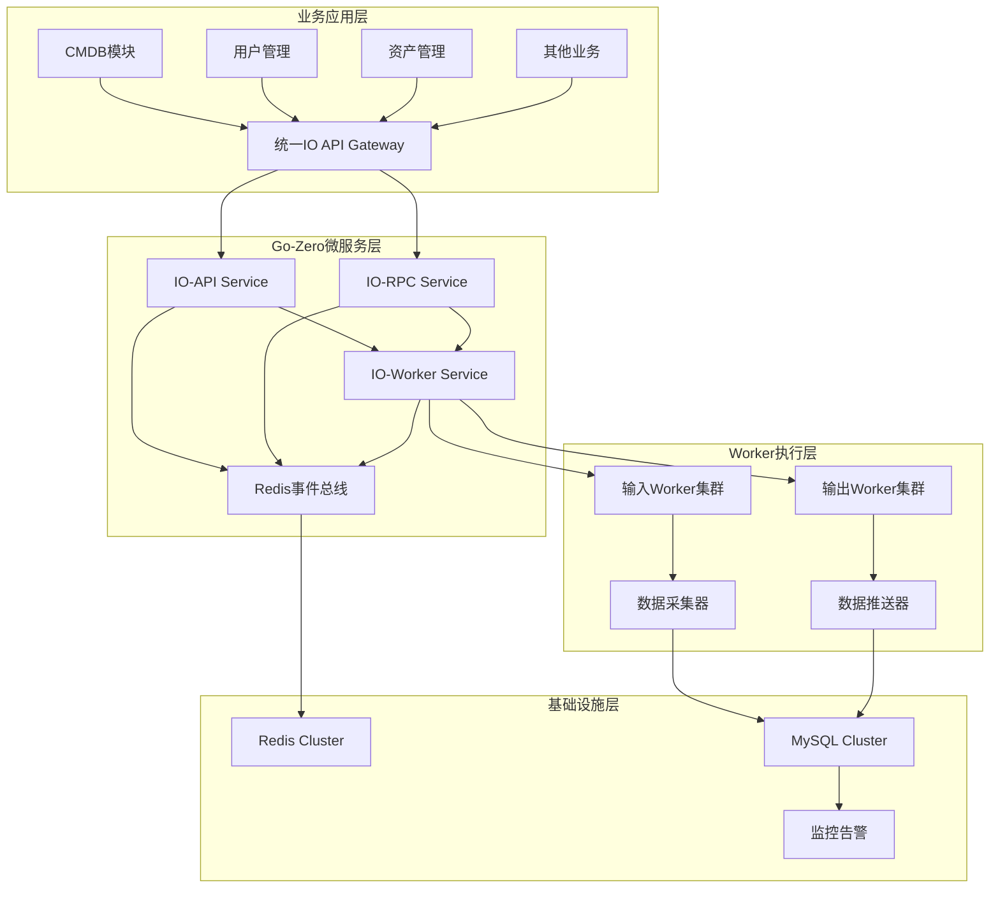
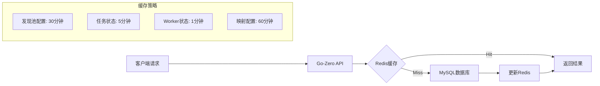
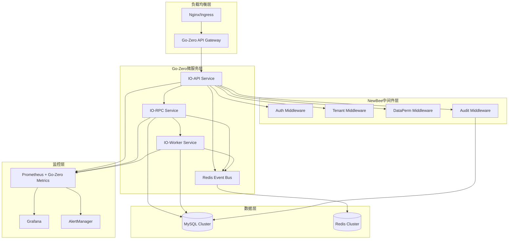

# 统一输入输出能力管理平台设计文档

## 1. 项目概述

### 1.1 背景
为了应对多种业务场景下的数据输入输出需求，设计一个兼容性高、扩展性强的统一输入输出能力管理平台。该平台将作为独立微服务，为CMDB、用户管理、资产管理等业务模块提供标准化的数据流转能力。

### 1.2 目标
- **统一输入**: 实现自动发现池，支持多种输入方式（文件、API、SDK、内置发现器）
- **统一输出**: 支持多种格式导出和目标推送（Kafka、ES、数据库、API等）
- **智能映射**: 提供字段映射和数据转换能力
- **任务管控**: 完善的任务管理、调度和监控能力
- **Worker模式**: 所有对外交互通过Worker池处理

## 2. 整体架构设计

### 2.1 Go-Zero微服务分层架构



### 2.2 Go-Zero架构核心设计原则

1. **Go-Zero分层解耦**: API层 → RPC层 → Worker层 → 数据层
2. **事件驱动架构**: 基于Redis事件总线解决循环依赖
3. **插件化**: 所有输入输出适配器采用插件模式
4. **Worker模式**: 基于Go-Zero的分布式Worker池处理
5. **统一中间件**: 集成NewBee common包安全中间件
6. **多租户隔离**: 基于Ent ORM的租户数据隔离
7. **配置驱动**: 通过Go-Zero配置实现业务规则灵活调整

## 3. 核心组件设计

### 3.1 统一IO平台接口

```go
// 统一IO平台接口定义
type UnifiedIOPlatform interface {
    // 输入能力
    RegisterInputAdapter(adapter InputAdapter) error
    CreateInputTask(config *InputTaskConfig) (*InputTask, error)
    
    // 输出能力  
    RegisterOutputAdapter(adapter OutputAdapter) error
    CreateOutputTask(config *OutputTaskConfig) (*OutputTask, error)
    
    // 任务管理
    GetTaskStatus(taskID string) (*TaskStatus, error)
    CancelTask(taskID string) error
    ListTasks(filter *TaskFilter) ([]*Task, error)
    
    // 配置管理
    CreateTemplate(template *IOTemplate) error
    GetTemplate(templateID string) (*IOTemplate, error)
    ListTemplates(filter *TemplateFilter) ([]*IOTemplate, error)
}

// 基础任务配置
type BaseTaskConfig struct {
    ID          string                 `json:"id"`
    Name        string                 `json:"name"`
    Description string                 `json:"description"`
    Priority    int                    `json:"priority"`
    Timeout     time.Duration          `json:"timeout"`
    Retry       *RetryConfig           `json:"retry"`
    Metadata    map[string]interface{} `json:"metadata"`
}

// 输入任务配置
type InputTaskConfig struct {
    BaseTaskConfig
    DiscoveryPoolID string              `json:"discovery_pool_id"`
    FieldMapping    *FieldMappingConfig `json:"field_mapping"`
    DataValidation  *ValidationConfig   `json:"data_validation"`
    OutputTargets   []*OutputTarget     `json:"output_targets"`
}

// 输出任务配置
type OutputTaskConfig struct {
    BaseTaskConfig
    DataSource      *DataSource         `json:"data_source"`
    OutputFormat    string              `json:"output_format"`
    PushTargets     []*PushTarget       `json:"push_targets"`
    Compression     *CompressionConfig  `json:"compression"`
}
```

### 3.2 发现池(Discovery Pool)设计

```go
// 发现池管理器 - 使用Redis事件总线解决循环依赖
type DiscoveryPoolManager struct {
    pools          map[string]*DiscoveryPool
    configManager  *ConfigManager
    eventBus       *RedisEventBus  // Redis事件总线，发布worker.request事件
    storage        DiscoveryPoolStorage
    logger         *log.Logger
}

// 解决循环依赖：不直接依赖WorkerManager，通过事件发布Worker需求
func (dpm *DiscoveryPoolManager) RequestWorker(poolID string, taskType string) error {
    event := &WorkerRequestEvent{
        PoolID:    poolID,
        TaskType:  taskType,
        Timestamp: time.Now(),
    }
    
    // 发布事件而不是直接调用WorkerManager
    return dpm.eventBus.Publish("worker.request", event)
}

// 发现池定义
type DiscoveryPool struct {
    ID              string                    `json:"id"`
    Name            string                    `json:"name"`
    Type            DiscoveryType            `json:"type"`
    Status          PoolStatus               `json:"status"`
    Config          *DiscoveryConfig         `json:"config"`
    FieldMapping    *FieldMappingConfig      `json:"field_mapping"`
    Workers         []*Worker                `json:"workers"`
    Metrics         *PoolMetrics             `json:"metrics"`
    CreatedAt       time.Time                `json:"created_at"`
    UpdatedAt       time.Time                `json:"updated_at"`
}

// 发现类型枚举
type DiscoveryType string

const (
    DiscoveryTypeFile    DiscoveryType = "file"
    DiscoveryTypeAPI     DiscoveryType = "api"
    DiscoveryTypeSDK     DiscoveryType = "sdk"
    DiscoveryTypeBuiltin DiscoveryType = "builtin"
)

// 池状态枚举
type PoolStatus string

const (
    PoolStatusActive   PoolStatus = "active"
    PoolStatusInactive PoolStatus = "inactive"
    PoolStatusError    PoolStatus = "error"
    PoolStatusMaintain PoolStatus = "maintain"
)

// 发现配置
type DiscoveryConfig struct {
    // 通用配置
    Enabled         bool                     `json:"enabled"`
    Schedule        string                   `json:"schedule"` // cron表达式
    BatchSize       int                      `json:"batch_size"`
    ConcurrentLimit int                      `json:"concurrent_limit"`
    RetryPolicy     *RetryPolicy            `json:"retry_policy"`
    
    // 文件发现配置
    FileConfig      *FileDiscoveryConfig     `json:"file_config,omitempty"`
    
    // API发现配置
    APIConfig       *APIDiscoveryConfig      `json:"api_config,omitempty"`
    
    // SDK发现配置
    SDKConfig       *SDKDiscoveryConfig      `json:"sdk_config,omitempty"`
    
    // 内置发现器配置
    BuiltinConfig   *BuiltinDiscoveryConfig  `json:"builtin_config,omitempty"`
}

// 文件发现配置
type FileDiscoveryConfig struct {
    WatchPaths       []string             `json:"watch_paths"`
    FilePatterns     []string             `json:"file_patterns"`
    MaxFileSize      int64                `json:"max_file_size"`
    SupportedFormats []string             `json:"supported_formats"`
    Encoding         string               `json:"encoding"`
    HeaderRow        int                  `json:"header_row"`
    DataStartRow     int                  `json:"data_start_row"`
    SheetName        string               `json:"sheet_name,omitempty"`
}

// API发现配置
type APIDiscoveryConfig struct {
    Endpoints        []*APIEndpoint       `json:"endpoints"`
    Authentication   *AuthConfig          `json:"authentication"`
    RateLimit        *RateLimitConfig     `json:"rate_limit"`
    Headers          map[string]string    `json:"headers"`
    Timeout          time.Duration        `json:"timeout"`
    ResponsePath     string               `json:"response_path"`
}

// SDK发现配置
type SDKDiscoveryConfig struct {
    SDKType          string               `json:"sdk_type"`
    SDKVersion       string               `json:"sdk_version"`
    Config           map[string]interface{} `json:"config"`
    PluginPath       string               `json:"plugin_path"`
}

// 内置发现器配置
type BuiltinDiscoveryConfig struct {
    DiscovererType   string               `json:"discoverer_type"`
    ScanTargets      []*ScanTarget        `json:"scan_targets"`
    ScanInterval     time.Duration        `json:"scan_interval"`
    DiscoveryRules   []*DiscoveryRule     `json:"discovery_rules"`
}
```

### 3.3 Worker架构设计

```go
// Worker管理器 - 订阅事件而不产生循环依赖
type WorkerManager struct {
    inputWorkers   *WorkerPool
    outputWorkers  *WorkerPool
    registry       *WorkerRegistry
    scheduler      *WorkerScheduler
    monitor        *WorkerMonitor
    scaler         *AutoScaler
    eventBus       *RedisEventBus  // 订阅worker.request事件
    logger         *log.Logger
}

// 通过事件监听处理Worker请求，避免循环依赖
func (wm *WorkerManager) StartEventListener(ctx context.Context) error {
    return wm.eventBus.Subscribe("worker.request", func(event *WorkerRequestEvent) error {
        // 处理Worker分配请求
        return wm.AllocateWorker(event.PoolID, event.TaskType)
    })
}

// Redis事件总线结构
type RedisEventBus struct {
    client    redis.Cmdable
    streamKey string
    logger    *log.Logger
}

// Worker请求事件结构
type WorkerRequestEvent struct {
    PoolID    string    `json:"pool_id"`
    TaskType  string    `json:"task_type"`
    Timestamp time.Time `json:"timestamp"`
}

// Worker接口定义
type Worker interface {
    GetID() string
    GetType() WorkerType
    GetStatus() WorkerStatus
    GetMetrics() *WorkerMetrics
    Start(ctx context.Context) error
    Stop() error
    Process(ctx context.Context, task *Task) error
    HealthCheck() error
}

// Worker类型枚举
type WorkerType string

const (
    WorkerTypeInput  WorkerType = "input"
    WorkerTypeOutput WorkerType = "output"
)

// Worker状态枚举
type WorkerStatus string

const (
    WorkerStatusIdle    WorkerStatus = "idle"
    WorkerStatusBusy    WorkerStatus = "busy"
    WorkerStatusError   WorkerStatus = "error"
    WorkerStatusStopped WorkerStatus = "stopped"
)

// 输入Worker实现
type InputWorker struct {
    ID           string
    Type         WorkerType
    Adapter      InputAdapter
    TaskQueue    chan *InputTask
    Status       WorkerStatus
    Metrics      *WorkerMetrics
    Config       *WorkerConfig
    ctx          context.Context
    cancel       context.CancelFunc
}

func (w *InputWorker) Process(ctx context.Context, task *Task) error {
    inputTask, ok := task.(*InputTask)
    if !ok {
        return fmt.Errorf("invalid task type for input worker")
    }
    
    // 更新状态
    w.Status = WorkerStatusBusy
    defer func() { w.Status = WorkerStatusIdle }()
    
    // 执行任务
    return w.Adapter.Process(ctx, inputTask)
}

// 输出Worker实现
type OutputWorker struct {
    ID           string
    Type         WorkerType
    Adapter      OutputAdapter
    TaskQueue    chan *OutputTask
    Status       WorkerStatus
    Metrics      *WorkerMetrics
    Config       *WorkerConfig
    ctx          context.Context
    cancel       context.CancelFunc
}

func (w *OutputWorker) Process(ctx context.Context, task *Task) error {
    outputTask, ok := task.(*OutputTask)
    if !ok {
        return fmt.Errorf("invalid task type for output worker")
    }
    
    // 更新状态
    w.Status = WorkerStatusBusy
    defer func() { w.Status = WorkerStatusIdle }()
    
    // 执行任务
    return w.Adapter.Export(ctx, outputTask)
}

// Worker池管理
type WorkerPool struct {
    workers    map[string]Worker
    capacity   int
    current    int
    queue      chan *Task
    dispatcher *TaskDispatcher
    mu         sync.RWMutex
}

// Worker调度器 - 移除循环依赖
type WorkerScheduler struct {
    loadBalancer  LoadBalancer
    healthChecker *HealthChecker
    scaler        *AutoScaler
    metrics       *SchedulerMetrics
    eventBus      *RedisEventBus  // 使用事件总线通信
    logger        *log.Logger
}

// 事件驱动的调度决策，避免直接依赖DiscoveryPoolManager
func (ws *WorkerScheduler) PublishScheduleEvent(workerID string, taskID string) error {
    event := &WorkerScheduleEvent{
        WorkerID:  workerID,
        TaskID:    taskID,
        Timestamp: time.Now(),
    }
    
    return ws.eventBus.Publish("worker.schedule", event)
}

// Worker调度事件
type WorkerScheduleEvent struct {
    WorkerID  string    `json:"worker_id"`
    TaskID    string    `json:"task_id"`
    Timestamp time.Time `json:"timestamp"`
}

// 负载均衡器接口
type LoadBalancer interface {
    SelectWorker(workers []Worker, task *Task) (Worker, error)
}

// 轮询负载均衡器
type RoundRobinBalancer struct {
    counter int64
}

func (lb *RoundRobinBalancer) SelectWorker(workers []Worker, task *Task) (Worker, error) {
    if len(workers) == 0 {
        return nil, fmt.Errorf("no available workers")
    }
    
    // 过滤可用Worker
    availableWorkers := make([]Worker, 0)
    for _, worker := range workers {
        if worker.GetStatus() == WorkerStatusIdle {
            availableWorkers = append(availableWorkers, worker)
        }
    }
    
    if len(availableWorkers) == 0 {
        return nil, fmt.Errorf("no idle workers available")
    }
    
    index := atomic.AddInt64(&lb.counter, 1) % int64(len(availableWorkers))
    return availableWorkers[index], nil
}

// 最少连接负载均衡器
type LeastConnectionsBalancer struct{}

func (lb *LeastConnectionsBalancer) SelectWorker(workers []Worker, task *Task) (Worker, error) {
    if len(workers) == 0 {
        return nil, fmt.Errorf("no available workers")
    }
    
    var selected Worker
    minConnections := int64(math.MaxInt64)
    
    for _, worker := range workers {
        if worker.GetStatus() != WorkerStatusIdle {
            continue
        }
        
        connections := worker.GetMetrics().ActiveTasks
        if connections < minConnections {
            minConnections = connections
            selected = worker
        }
    }
    
    if selected == nil {
        return nil, fmt.Errorf("no idle worker available")
    }
    
    return selected, nil
}
```

### 3.4 字段映射设计

```go
// 字段映射配置
type FieldMappingConfig struct {
    ID              string                   `json:"id"`
    Name            string                   `json:"name"`
    Description     string                   `json:"description"`
    Version         string                   `json:"version"`
    SourceSchema    *DataSchema             `json:"source_schema"`
    TargetSchema    *DataSchema             `json:"target_schema"`
    Mappings        []*FieldMapping         `json:"mappings"`
    Transformations []*DataTransformation   `json:"transformations"`
    Validations     []*ValidationRule       `json:"validations"`
    CreatedAt       time.Time               `json:"created_at"`
    UpdatedAt       time.Time               `json:"updated_at"`
}

// 数据模式定义
type DataSchema struct {
    ID          string          `json:"id"`
    Name        string          `json:"name"`
    Type        string          `json:"type"`
    Fields      []*SchemaField  `json:"fields"`
    Constraints []*Constraint   `json:"constraints"`
}

// 模式字段
type SchemaField struct {
    Name        string                 `json:"name"`
    Type        string                 `json:"type"`
    Required    bool                   `json:"required"`
    Description string                 `json:"description"`
    Example     interface{}            `json:"example"`
    Properties  map[string]interface{} `json:"properties"`
}

// 字段映射
type FieldMapping struct {
    ID              string                  `json:"id"`
    SourceField     string                  `json:"source_field"`
    TargetField     string                  `json:"target_field"`
    DataType        string                  `json:"data_type"`
    Required        bool                    `json:"required"`
    DefaultValue    interface{}             `json:"default_value"`
    Validator       *FieldValidator         `json:"validator"`
    Transformer     *FieldTransformer       `json:"transformer"`
    Description     string                  `json:"description"`
}

// 字段验证器
type FieldValidator struct {
    Type        string                 `json:"type"`
    Rules       []*ValidationRule      `json:"rules"`
    ErrorMessage string                `json:"error_message"`
    Required    bool                   `json:"required"`
}

// 验证规则
type ValidationRule struct {
    Type        string                 `json:"type"`
    Parameters  map[string]interface{} `json:"parameters"`
    Message     string                 `json:"message"`
}

// 字段转换器
type FieldTransformer struct {
    Type        string                 `json:"type"`
    Function    string                 `json:"function"`
    Parameters  map[string]interface{} `json:"parameters"`
    Script      string                 `json:"script,omitempty"`
}

// 数据转换
type DataTransformation struct {
    ID          string                 `json:"id"`
    Name        string                 `json:"name"`
    Type        string                 `json:"type"`
    SourceField string                 `json:"source_field"`
    TargetField string                 `json:"target_field"`
    Expression  string                 `json:"expression"`
    Parameters  map[string]interface{} `json:"parameters"`
    Order       int                    `json:"order"`
}

// 智能字段映射引擎
type FieldMappingEngine struct {
    aiMatcher       *AIFieldMatcher
    ruleEngine      *MappingRuleEngine
    historyLearner  *MappingHistoryLearner
    storage         MappingStorage
}

func (engine *FieldMappingEngine) AutoMapping(source, target *DataSchema) (*FieldMappingConfig, error) {
    ctx := context.Background()
    
    // 1. AI语义匹配
    aiMappings, err := engine.aiMatcher.Match(ctx, source, target)
    if err != nil {
        return nil, fmt.Errorf("AI matching failed: %w", err)
    }
    
    // 2. 规则引擎匹配
    ruleMappings, err := engine.ruleEngine.Match(ctx, source, target)
    if err != nil {
        return nil, fmt.Errorf("rule matching failed: %w", err)
    }
    
    // 3. 历史学习匹配
    historyMappings, err := engine.historyLearner.Match(ctx, source, target)
    if err != nil {
        return nil, fmt.Errorf("history matching failed: %w", err)
    }
    
    // 4. 融合结果
    return engine.mergeMappings(aiMappings, ruleMappings, historyMappings)
}

// AI字段匹配器
type AIFieldMatcher struct {
    model       *SemanticModel
    vectorizer  *FieldVectorizer
    similarity  *SimilarityCalculator
}

func (matcher *AIFieldMatcher) Match(ctx context.Context, source, target *DataSchema) ([]*FieldMapping, error) {
    var mappings []*FieldMapping
    
    // 向量化字段
    sourceVectors := matcher.vectorizer.Vectorize(source.Fields)
    targetVectors := matcher.vectorizer.Vectorize(target.Fields)
    
    // 计算相似度
    for i, sourceField := range source.Fields {
        bestMatch := -1
        bestScore := 0.0
        
        for j, targetField := range target.Fields {
            score := matcher.similarity.Calculate(sourceVectors[i], targetVectors[j])
            if score > bestScore && score > 0.8 { // 阈值
                bestScore = score
                bestMatch = j
            }
        }
        
        if bestMatch >= 0 {
            mapping := &FieldMapping{
                ID:          generateID(),
                SourceField: sourceField.Name,
                TargetField: target.Fields[bestMatch].Name,
                DataType:    target.Fields[bestMatch].Type,
            }
            mappings = append(mappings, mapping)
        }
    }
    
    return mappings, nil
}
```

### 3.5 输入适配器设计

```go
// 输入适配器接口
type InputAdapter interface {
    GetType() string
    GetCapabilities() *AdapterCapabilities
    Discover(ctx context.Context, config *DiscoveryConfig) (*DiscoveryResult, error)
    Process(ctx context.Context, task *InputTask) error
    GetFieldMapping() *FieldMappingSchema
    Validate(config interface{}) error
}

// 适配器能力描述
type AdapterCapabilities struct {
    SupportedFormats   []string            `json:"supported_formats"`
    SupportedProtocols []string            `json:"supported_protocols"`
    BatchSupport       bool                `json:"batch_support"`
    StreamSupport      bool                `json:"stream_support"`
    SchemaDetection    bool                `json:"schema_detection"`
    IncrementalSync    bool                `json:"incremental_sync"`
    Features           map[string]bool     `json:"features"`
}

// 基础适配器
type BaseAdapter struct {
    ID           string
    Type         string
    Version      string
    Config       interface{}
    Capabilities *AdapterCapabilities
    Metrics      *AdapterMetrics
    Logger       *Logger
}

// 文件输入适配器
type FileInputAdapter struct {
    BaseAdapter
    fileProcessor *FileProcessor
    validator     *FileValidator
    parser        map[string]FileParser
}

func (adapter *FileInputAdapter) Process(ctx context.Context, task *InputTask) error {
    config := task.Config.(*FileDiscoveryConfig)
    
    // 1. 文件发现
    files, err := adapter.discoverFiles(ctx, config)
    if err != nil {
        return fmt.Errorf("file discovery failed: %w", err)
    }
    
    // 2. 文件处理
    for _, file := range files {
        if err := adapter.processFile(ctx, file, task); err != nil {
            adapter.Logger.Error("process file failed", "file", file.Path, "error", err)
            continue
        }
    }
    
    return nil
}

func (adapter *FileInputAdapter) processFile(ctx context.Context, file *FileInfo, task *InputTask) error {
    // 1. 文件验证
    if err := adapter.validator.Validate(file); err != nil {
        return fmt.Errorf("file validation failed: %w", err)
    }
    
    // 2. 选择解析器
    parser, ok := adapter.parser[file.Format]
    if !ok {
        return fmt.Errorf("unsupported file format: %s", file.Format)
    }
    
    // 3. 解析文件
    data, err := parser.Parse(ctx, file)
    if err != nil {
        return fmt.Errorf("file parsing failed: %w", err)
    }
    
    // 4. 数据处理
    return adapter.processData(ctx, data, task)
}

// API输入适配器
type APIInputAdapter struct {
    BaseAdapter
    httpClient    *HTTPClient
    rateLimiter   *RateLimiter
    auth          *AuthManager
    retry         *RetryManager
}

func (adapter *APIInputAdapter) Process(ctx context.Context, task *InputTask) error {
    config := task.Config.(*APIDiscoveryConfig)
    
    for _, endpoint := range config.Endpoints {
        if err := adapter.processEndpoint(ctx, endpoint, task); err != nil {
            adapter.Logger.Error("process endpoint failed", "endpoint", endpoint.URL, "error", err)
            continue
        }
    }
    
    return nil
}

func (adapter *APIInputAdapter) processEndpoint(ctx context.Context, endpoint *APIEndpoint, task *InputTask) error {
    // 1. 速率限制
    if err := adapter.rateLimiter.Wait(ctx); err != nil {
        return fmt.Errorf("rate limit exceeded: %w", err)
    }
    
    // 2. 构建请求
    req, err := adapter.buildRequest(ctx, endpoint)
    if err != nil {
        return fmt.Errorf("build request failed: %w", err)
    }
    
    // 3. 发送请求
    resp, err := adapter.httpClient.Do(req)
    if err != nil {
        return fmt.Errorf("request failed: %w", err)
    }
    defer resp.Body.Close()
    
    // 4. 处理响应
    return adapter.processResponse(ctx, resp, task)
}

// SDK输入适配器
type SDKInputAdapter struct {
    BaseAdapter
    sdkManager    *SDKManager
    pluginLoader  *PluginLoader
    sandbox       *PluginSandbox
}

func (adapter *SDKInputAdapter) Process(ctx context.Context, task *InputTask) error {
    config := task.Config.(*SDKDiscoveryConfig)
    
    // 1. 加载SDK插件
    plugin, err := adapter.pluginLoader.Load(config.SDKType, config.PluginPath)
    if err != nil {
        return fmt.Errorf("load plugin failed: %w", err)
    }
    
    // 2. 在沙箱中执行
    result, err := adapter.sandbox.Execute(ctx, plugin, config.Config)
    if err != nil {
        return fmt.Errorf("plugin execution failed: %w", err)
    }
    
    // 3. 处理结果
    return adapter.processPluginResult(ctx, result, task)
}

// 内置发现器适配器
type BuiltinDiscoveryAdapter struct {
    BaseAdapter
    discoverers   map[string]Discoverer
    scheduler     *DiscoveryScheduler
}

func (adapter *BuiltinDiscoveryAdapter) Process(ctx context.Context, task *InputTask) error {
    config := task.Config.(*BuiltinDiscoveryConfig)
    
    // 1. 获取发现器
    discoverer, ok := adapter.discoverers[config.DiscovererType]
    if !ok {
        return fmt.Errorf("discoverer not found: %s", config.DiscovererType)
    }
    
    // 2. 执行发现
    items, err := discoverer.Discover(ctx, config)
    if err != nil {
        return fmt.Errorf("discovery failed: %w", err)
    }
    
    // 3. 处理发现的项目
    return adapter.processDiscoveredItems(ctx, items, task)
}
```

### 3.6 输出适配器设计

```go
// 输出适配器接口
type OutputAdapter interface {
    GetType() string
    GetCapabilities() *AdapterCapabilities
    Export(ctx context.Context, task *OutputTask) error
    Push(ctx context.Context, data *OutputData, target *PushTarget) error
    ValidateTarget(target *PushTarget) error
    GetSupportedFormats() []string
}

// 文件输出适配器
type FileOutputAdapter struct {
    BaseAdapter
    formatters map[string]FileFormatter
    compressor *FileCompressor
    uploader   *FileUploader
    storage    *FileStorage
}

func (adapter *FileOutputAdapter) Export(ctx context.Context, task *OutputTask) error {
    config := task.Config
    
    // 1. 获取数据
    data, err := adapter.fetchData(ctx, config.DataSource)
    if err != nil {
        return fmt.Errorf("fetch data failed: %w", err)
    }
    
    // 2. 格式化数据
    formatter, ok := adapter.formatters[config.OutputFormat]
    if !ok {
        return fmt.Errorf("unsupported format: %s", config.OutputFormat)
    }
    
    formattedData, err := formatter.Format(ctx, data)
    if err != nil {
        return fmt.Errorf("format data failed: %w", err)
    }
    
    // 3. 压缩（如果配置）
    if config.Compression != nil {
        formattedData, err = adapter.compressor.Compress(formattedData, config.Compression)
        if err != nil {
            return fmt.Errorf("compress data failed: %w", err)
        }
    }
    
    // 4. 存储文件
    fileName := adapter.generateFileName(config.OutputFormat, config.Compression)
    fileURL, err := adapter.storage.Store(ctx, fileName, formattedData)
    if err != nil {
        return fmt.Errorf("store file failed: %w", err)
    }
    
    // 5. 推送到目标（如果配置）
    for _, target := range config.PushTargets {
        if err := adapter.Push(ctx, &OutputData{
            Format: config.OutputFormat,
            URL:    fileURL,
            Data:   formattedData,
        }, target); err != nil {
            adapter.Logger.Error("push to target failed", "target", target.Type, "error", err)
        }
    }
    
    return nil
}

// Kafka输出适配器
type KafkaOutputAdapter struct {
    BaseAdapter
    producer    *KafkaProducer
    serializer  *MessageSerializer
    partitioner *MessagePartitioner
}

func (adapter *KafkaOutputAdapter) Push(ctx context.Context, data *OutputData, target *PushTarget) error {
    config := target.Config.(*KafkaConfig)
    
    // 1. 序列化消息
    message, err := adapter.serializer.Serialize(data, config.SerializationFormat)
    if err != nil {
        return fmt.Errorf("serialize message failed: %w", err)
    }
    
    // 2. 分区选择
    partition, err := adapter.partitioner.SelectPartition(config.Topic, message, config.PartitionStrategy)
    if err != nil {
        return fmt.Errorf("select partition failed: %w", err)
    }
    
    // 3. 发送消息
    return adapter.producer.Send(ctx, &ProducerRecord{
        Topic:     config.Topic,
        Partition: partition,
        Key:       message.Key,
        Value:     message.Value,
        Headers:   message.Headers,
    })
}

// Elasticsearch输出适配器
type ElasticsearchOutputAdapter struct {
    BaseAdapter
    client      *ESClient
    indexer     *ESIndexer
    mapper      *ESDocumentMapper
}

func (adapter *ElasticsearchOutputAdapter) Push(ctx context.Context, data *OutputData, target *PushTarget) error {
    config := target.Config.(*ElasticsearchConfig)
    
    // 1. 数据转换
    documents, err := adapter.mapper.Map(data, config.Mapping)
    if err != nil {
        return fmt.Errorf("map documents failed: %w", err)
    }
    
    // 2. 批量索引
    return adapter.indexer.BulkIndex(ctx, config.Index, documents)
}

// 数据库输出适配器
type DatabaseOutputAdapter struct {
    BaseAdapter
    connPool    *ConnectionPool
    sqlBuilder  *SQLBuilder
    migration   *SchemaMigration
}

func (adapter *DatabaseOutputAdapter) Push(ctx context.Context, data *OutputData, target *PushTarget) error {
    config := target.Config.(*DatabaseConfig)
    
    // 1. 获取连接
    conn, err := adapter.connPool.Get(ctx)
    if err != nil {
        return fmt.Errorf("get connection failed: %w", err)
    }
    defer adapter.connPool.Put(conn)
    
    // 2. 开始事务
    tx, err := conn.BeginTx(ctx, nil)
    if err != nil {
        return fmt.Errorf("begin transaction failed: %w", err)
    }
    defer tx.Rollback()
    
    // 3. 执行数据插入
    sql, args := adapter.sqlBuilder.BuildInsertSQL(config.Table, data)
    if _, err := tx.ExecContext(ctx, sql, args...); err != nil {
        return fmt.Errorf("execute insert failed: %w", err)
    }
    
    // 4. 提交事务
    return tx.Commit()
}

// API推送适配器
type APIPushAdapter struct {
    BaseAdapter
    httpClient  *HTTPClient
    retry       *RetryPolicy
    rateLimit   *RateLimiter
    auth        *AuthManager
}

func (adapter *APIPushAdapter) Push(ctx context.Context, data *OutputData, target *PushTarget) error {
    config := target.Config.(*APIConfig)
    
    // 1. 速率限制
    if err := adapter.rateLimit.Wait(ctx); err != nil {
        return fmt.Errorf("rate limit exceeded: %w", err)
    }
    
    // 2. 构建请求
    req, err := adapter.buildPushRequest(ctx, data, config)
    if err != nil {
        return fmt.Errorf("build request failed: %w", err)
    }
    
    // 3. 发送请求（带重试）
    return adapter.retry.Do(ctx, func() error {
        resp, err := adapter.httpClient.Do(req)
        if err != nil {
            return err
        }
        defer resp.Body.Close()
        
        if resp.StatusCode >= 400 {
            return fmt.Errorf("push failed with status: %d", resp.StatusCode)
        }
        
        return nil
    })
}
```

### 3.7 任务管理和调度

```go
// 任务管理器
type TaskManager struct {
    scheduler      *TaskScheduler
    executor       *TaskExecutor
    monitor        *TaskMonitor
    storage        *TaskStorage
    eventBus       *EventBus
    queue          TaskQueue
}

// 任务接口
type Task interface {
    GetID() string
    GetType() TaskType
    GetStatus() TaskStatus
    GetConfig() interface{}
    GetMetrics() *TaskMetrics
    SetStatus(status TaskStatus)
    Cancel() error
}

// 任务类型枚举
type TaskType string

const (
    TaskTypeInput  TaskType = "input"
    TaskTypeOutput TaskType = "output"
)

// 任务状态枚举
type TaskStatus string

const (
    TaskStatusPending    TaskStatus = "pending"
    TaskStatusRunning    TaskStatus = "running"
    TaskStatusCompleted  TaskStatus = "completed"
    TaskStatusFailed     TaskStatus = "failed"
    TaskStatusCancelled  TaskStatus = "cancelled"
)

// 基础任务
type BaseTask struct {
    ID          string                 `json:"id"`
    Type        TaskType              `json:"type"`
    Status      TaskStatus            `json:"status"`
    Priority    int                   `json:"priority"`
    Config      interface{}           `json:"config"`
    Metrics     *TaskMetrics          `json:"metrics"`
    Error       string                `json:"error,omitempty"`
    CreatedAt   time.Time             `json:"created_at"`
    StartedAt   *time.Time            `json:"started_at,omitempty"`
    CompletedAt *time.Time            `json:"completed_at,omitempty"`
    Metadata    map[string]interface{} `json:"metadata"`
}

// 输入任务
type InputTask struct {
    BaseTask
    DiscoveryPoolID string              `json:"discovery_pool_id"`
    FieldMapping    *FieldMappingConfig `json:"field_mapping"`
    DataValidation  *ValidationConfig   `json:"data_validation"`
    OutputTargets   []*OutputTarget     `json:"output_targets"`
}

// 输出任务
type OutputTask struct {
    BaseTask
    DataSource      *DataSource         `json:"data_source"`
    OutputFormat    string              `json:"output_format"`
    PushTargets     []*PushTarget       `json:"push_targets"`
    Compression     *CompressionConfig  `json:"compression"`
}

// 任务调度器
type TaskScheduler struct {
    cronScheduler  *CronScheduler
    queueManager   *QueueManager
    prioritizer    *TaskPrioritizer
    loadBalancer   *LoadBalancer
}

func (scheduler *TaskScheduler) ScheduleTask(task Task) error {
    // 1. 任务优先级计算
    priority := scheduler.prioritizer.CalculatePriority(task)
    
    // 2. 加入队列
    return scheduler.queueManager.Enqueue(task, priority)
}

func (scheduler *TaskScheduler) GetNextTask() (Task, error) {
    return scheduler.queueManager.Dequeue()
}

// 任务执行器
type TaskExecutor struct {
    workerManager  *WorkerManager
    pipeline       *ExecutionPipeline
    rollback       *RollbackManager
    checkpoint     *CheckpointManager
}

func (executor *TaskExecutor) ExecuteTask(ctx context.Context, task Task) error {
    // 1. 选择Worker
    worker, err := executor.workerManager.SelectWorker(task.GetType())
    if err != nil {
        return fmt.Errorf("select worker failed: %w", err)
    }
    
    // 2. 创建检查点
    checkpoint, err := executor.checkpoint.Create(task)
    if err != nil {
        return fmt.Errorf("create checkpoint failed: %w", err)
    }
    
    // 3. 执行任务
    task.SetStatus(TaskStatusRunning)
    err = worker.Process(ctx, task)
    
    if err != nil {
        // 回滚
        if rollbackErr := executor.rollback.Rollback(ctx, task, checkpoint); rollbackErr != nil {
            executor.Logger.Error("rollback failed", "task", task.GetID(), "error", rollbackErr)
        }
        task.SetStatus(TaskStatusFailed)
        return err
    }
    
    task.SetStatus(TaskStatusCompleted)
    return nil
}

// 执行管道
type ExecutionPipeline struct {
    stages []PipelineStage
}

type PipelineStage interface {
    Execute(ctx context.Context, task Task) (*StageResult, error)
    Rollback(ctx context.Context, task Task) error
    GetName() string
}

// 数据验证阶段
type ValidationStage struct {
    validator *DataValidator
}

func (stage *ValidationStage) Execute(ctx context.Context, task Task) (*StageResult, error) {
    return stage.validator.Validate(ctx, task)
}

// 数据转换阶段
type TransformationStage struct {
    transformer *DataTransformer
}

func (stage *TransformationStage) Execute(ctx context.Context, task Task) (*StageResult, error) {
    return stage.transformer.Transform(ctx, task)
}

// 数据加载阶段
type LoadStage struct {
    loader *DataLoader
}

func (stage *LoadStage) Execute(ctx context.Context, task Task) (*StageResult, error) {
    return stage.loader.Load(ctx, task)
}
```

### 3.8 配置管理设计

```go
// 配置管理器
type ConfigManager struct {
    storage         ConfigStorage
    validator       *ConfigValidator
    versionControl  *ConfigVersionControl
    encryption      *ConfigEncryption
    hotReload       *HotReloadManager
    watcher         *ConfigWatcher
}

// 配置存储接口
type ConfigStorage interface {
    Get(ctx context.Context, key string) (*Config, error)
    Set(ctx context.Context, key string, config *Config) error
    Delete(ctx context.Context, key string) error
    List(ctx context.Context, prefix string) ([]*Config, error)
    Watch(ctx context.Context, key string) (<-chan *ConfigEvent, error)
}

// 配置定义
type Config struct {
    Key         string                 `json:"key"`
    Value       interface{}            `json:"value"`
    Version     string                 `json:"version"`
    Metadata    map[string]interface{} `json:"metadata"`
    CreatedAt   time.Time              `json:"created_at"`
    UpdatedAt   time.Time              `json:"updated_at"`
    Encrypted   bool                   `json:"encrypted"`
}

// 配置事件
type ConfigEvent struct {
    Type   ConfigEventType `json:"type"`
    Key    string          `json:"key"`
    Config *Config         `json:"config"`
}

type ConfigEventType string

const (
    ConfigEventTypeCreated ConfigEventType = "created"
    ConfigEventTypeUpdated ConfigEventType = "updated"
    ConfigEventTypeDeleted ConfigEventType = "deleted"
)

// 配置模板
type ConfigTemplate struct {
    ID          string                 `json:"id"`
    Name        string                 `json:"name"`
    Type        string                 `json:"type"`
    Version     string                 `json:"version"`
    Schema      *ConfigSchema         `json:"schema"`
    Defaults    map[string]interface{} `json:"defaults"`
    Validation  *ConfigValidation     `json:"validation"`
    Description string                 `json:"description"`
}

// 配置模式
type ConfigSchema struct {
    Type       string                    `json:"type"`
    Properties map[string]*PropertySchema `json:"properties"`
    Required   []string                  `json:"required"`
}

type PropertySchema struct {
    Type        string      `json:"type"`
    Description string      `json:"description"`
    Default     interface{} `json:"default,omitempty"`
    Enum        []string    `json:"enum,omitempty"`
    Minimum     *float64    `json:"minimum,omitempty"`
    Maximum     *float64    `json:"maximum,omitempty"`
    Pattern     string      `json:"pattern,omitempty"`
}

// 配置验证
type ConfigValidation struct {
    Rules    []*ValidationRule `json:"rules"`
    Required []string          `json:"required"`
    Custom   []*CustomValidator `json:"custom"`
}

// 热重载管理器
type HotReloadManager struct {
    watchers map[string]*ConfigWatcher
    handlers map[string]ReloadHandler
    mu       sync.RWMutex
}

type ReloadHandler interface {
    HandleReload(config *Config) error
}

func (manager *HotReloadManager) RegisterHandler(configKey string, handler ReloadHandler) {
    manager.mu.Lock()
    defer manager.mu.Unlock()
    manager.handlers[configKey] = handler
}

func (manager *HotReloadManager) StartWatching(configKey string) error {
    manager.mu.Lock()
    defer manager.mu.Unlock()
    
    watcher := &ConfigWatcher{
        configKey: configKey,
        handler:   manager.handlers[configKey],
    }
    
    manager.watchers[configKey] = watcher
    return watcher.Start()
}
```

### 3.9 NewBee统一中间件集成

```go
// NewBee统一中间件集成 - 替代通用安全方案
type UnifiedIOServiceContext struct {
    Config               config.Config
    ContextManager       *keys.ContextManager
    IoRpc                ioclient.Io           // IO RPC客户端
    CoreRpc              coreclient.Core       // Core RPC客户端
    Trans                *i18n.Translator      // 国际化
    // 🎯 统一中间件集成结果
    IntegrationResult    *integration.Result
    // 统一中间件链
    ManagedMiddlewareChain []rest.Middleware
}

// 集成NewBee公共中间件框架
func NewUnifiedIOServiceContext(c config.Config) *UnifiedIOServiceContext {
    // ===========================================
    // 🎉 统一中间件框架集成 - IO服务
    // ===========================================

    // 1. 初始化基础服务
    rds := redis.NewUniversalClient(&redis.UniversalOptions{
        Addrs:    []string{c.RedisConf.Host},
        Password: c.RedisConf.Pass,
        DB:       c.RedisConf.Db,
    })

    trans := i18n.NewTranslator(c.I18nConf, i18n2.LocaleFS)
    
    // 2. 初始化RPC客户端 - 使用SystemContext拦截器支持系统级操作
    ioRpcClient, err := zrpc.NewClient(c.IoRpc, zrpc.WithUnaryClientInterceptor(hooks.SystemContextClientInterceptor()))
    if err != nil {
        panic("Failed to create IO RPC client: " + err.Error())
    }
    ioRpc := ioclient.NewIo(ioRpcClient)
    
    coreRpcClient, err := zrpc.NewClient(c.CoreRpc, zrpc.WithUnaryClientInterceptor(hooks.SystemContextClientInterceptor()))
    if err != nil {
        panic("Failed to create Core RPC client: " + err.Error())
    }
    coreRpc := coreclient.NewCore(coreRpcClient)

    // 3. 获取JWT密钥 - 优先使用Middleware配置
    jwtSecret := c.Auth.AccessSecret
    if c.Middleware.Auth != nil && c.Middleware.Auth.AccessSecret != "" {
        jwtSecret = c.Middleware.Auth.AccessSecret
    }

    // 4. 创建服务上下文实例（需要先创建以便传递给审计插件）
    svcCtx := &UnifiedIOServiceContext{
        Config:  c,
        IoRpc:   ioRpc,
        CoreRpc: coreRpc,
        Trans:   trans,
    }

    // 5. 🎯 使用统一中间件集成API，创建审计写入器
    //    更多集成说明参见 docs/COMMON_AUDIT_MIDDLEWARE_GUIDE.md
    ioAuditWriter := audit.NewBuiltinAuditWriter(svcCtx)
    
    result, err := integration.Setup(&integration.Config{
        Redis:               rds,
        JWTSecret:           jwtSecret,
        Mode:                integration.Production,
        ApiResourceProvider: NewRpcApiResourceProvider(coreRpc),
        // 使用common包的BuiltinAuditWriter通过Core RPC写入审计日志
        AuditWriter:         ioAuditWriter,
        Middleware:          &c.Middleware,
    })
    if err != nil {
        panic("IO统一中间件集成失败: " + err.Error())
    }

    // 6. 完善服务上下文
    svcCtx.ContextManager = result.ContextManager
    svcCtx.IntegrationResult = result
    svcCtx.ManagedMiddlewareChain = result.Middlewares

    return svcCtx
}

// 获取审计RPC客户端接口实现
func (svc *UnifiedIOServiceContext) GetCoreRpcClient() interface{} {
    return svc.CoreRpc
}
```

> **集成提示**：部署在反向代理后的服务建议在 `middleware.audit.realIpHeader`
> 中配置可信头部（如 `X-Forwarded-For`），并按需调整
> `middleware.audit.captureResponseBody`、`asyncWorkers` 等参数以匹配业务流量。

### 3.10 监控和可观测性

```go
// 监控管理器
type MonitoringManager struct {
    metricsCollector *MetricsCollector
    alertManager     *AlertManager
    dashboard        *DashboardManager
    tracer           *DistributedTracer
    logger           *StructuredLogger
}

// 关键指标定义
type PlatformMetrics struct {
    // 任务指标
    TaskTotal         *prometheus.CounterVec
    TaskSuccess       *prometheus.CounterVec
    TaskFailed        *prometheus.CounterVec
    TaskDuration      *prometheus.HistogramVec
    TaskQueueSize     *prometheus.GaugeVec
    
    // Worker指标
    WorkerTotal       *prometheus.GaugeVec
    WorkerActive      *prometheus.GaugeVec
    WorkerUtilization *prometheus.HistogramVec
    WorkerErrors      *prometheus.CounterVec
    
    // 数据流指标
    DataInputRate     *prometheus.CounterVec
    DataOutputRate    *prometheus.CounterVec
    DataErrorRate     *prometheus.CounterVec
    DataLatency       *prometheus.HistogramVec
    DataVolume        *prometheus.CounterVec
    
    // 资源指标
    CPUUsage          *prometheus.GaugeVec
    MemoryUsage       *prometheus.GaugeVec
    DiskUsage         *prometheus.GaugeVec
    NetworkIO         *prometheus.CounterVec
    
    // 适配器指标
    AdapterCalls      *prometheus.CounterVec
    AdapterLatency    *prometheus.HistogramVec
    AdapterErrors     *prometheus.CounterVec
}

// 指标收集器
type MetricsCollector struct {
    registry *prometheus.Registry
    metrics  *PlatformMetrics
    scrapers []MetricsScraper
}

func (collector *MetricsCollector) CollectTaskMetrics(task Task) {
    labels := prometheus.Labels{
        "task_type": string(task.GetType()),
        "status":    string(task.GetStatus()),
    }
    
    collector.metrics.TaskTotal.With(labels).Inc()
    
    if task.GetStatus() == TaskStatusCompleted {
        collector.metrics.TaskSuccess.With(labels).Inc()
        
        if task.GetMetrics() != nil {
            duration := task.GetMetrics().Duration.Seconds()
            collector.metrics.TaskDuration.With(labels).Observe(duration)
        }
    } else if task.GetStatus() == TaskStatusFailed {
        collector.metrics.TaskFailed.With(labels).Inc()
    }
}

func (collector *MetricsCollector) CollectWorkerMetrics(worker Worker) {
    labels := prometheus.Labels{
        "worker_id":   worker.GetID(),
        "worker_type": string(worker.GetType()),
        "status":      string(worker.GetStatus()),
    }
    
    collector.metrics.WorkerActive.With(labels).Set(1)
    
    if metrics := worker.GetMetrics(); metrics != nil {
        collector.metrics.WorkerUtilization.With(labels).Observe(metrics.Utilization)
    }
}

// 告警管理器
type AlertManager struct {
    rules       []*AlertRule
    channels    map[string]AlertChannel
    history     *AlertHistory
    suppressor  *AlertSuppressor
}

// 告警规则
type AlertRule struct {
    ID          string               `json:"id"`
    Name        string               `json:"name"`
    Query       string               `json:"query"`
    Threshold   float64              `json:"threshold"`
    Operator    string               `json:"operator"`
    Duration    time.Duration        `json:"duration"`
    Severity    AlertSeverity        `json:"severity"`
    Labels      map[string]string    `json:"labels"`
    Annotations map[string]string    `json:"annotations"`
    Enabled     bool                 `json:"enabled"`
}

type AlertSeverity string

const (
    AlertSeverityInfo     AlertSeverity = "info"
    AlertSeverityWarning  AlertSeverity = "warning"
    AlertSeverityCritical AlertSeverity = "critical"
)

// 告警通道接口
type AlertChannel interface {
    Send(ctx context.Context, alert *Alert) error
    GetType() string
}

// 邮件告警通道
type EmailAlertChannel struct {
    smtpConfig *SMTPConfig
    templates  *EmailTemplates
}

// Slack告警通道
type SlackAlertChannel struct {
    webhookURL string
    channel    string
    templates  *SlackTemplates
}

// 微信告警通道
type WeChatAlertChannel struct {
    corpID     string
    agentID    string
    secret     string
    templates  *WeChatTemplates
}

// 分布式追踪
type DistributedTracer struct {
    tracer opentracing.Tracer
    closer io.Closer
}

func (dt *DistributedTracer) StartSpan(operationName string, opts ...opentracing.StartSpanOption) opentracing.Span {
    return dt.tracer.StartSpan(operationName, opts...)
}

func (dt *DistributedTracer) TraceTask(ctx context.Context, task Task) (context.Context, opentracing.Span) {
    span := dt.StartSpan(fmt.Sprintf("task.%s", task.GetType()))
    span.SetTag("task.id", task.GetID())
    span.SetTag("task.type", task.GetType())
    span.SetTag("task.status", task.GetStatus())
    
    return opentracing.ContextWithSpan(ctx, span), span
}

// 结构化日志
type StructuredLogger struct {
    logger *logrus.Logger
    fields logrus.Fields
}

func (sl *StructuredLogger) WithTask(task Task) *StructuredLogger {
    return &StructuredLogger{
        logger: sl.logger,
        fields: logrus.Fields{
            "task_id":   task.GetID(),
            "task_type": task.GetType(),
        },
    }
}

func (sl *StructuredLogger) WithWorker(worker Worker) *StructuredLogger {
    return &StructuredLogger{
        logger: sl.logger,
        fields: logrus.Fields{
            "worker_id":   worker.GetID(),
            "worker_type": worker.GetType(),
        },
    }
}
```

## 4. 数据模型设计

### 4.1 简化缓存策略

#### 4.1.1 Redis + Database 简化架构



#### 4.1.2 缓存关键策略

```go
// 统一IO平台缓存管理器 - 简化版本
type IOCacheManager struct {
    redis    redis.Cmdable
    database *sql.DB
    logger   *log.Logger
}

// 缓存键名规范
const (
    // 发现池缓存：30分钟
    DiscoveryPoolCachePrefix = "io:pool:"
    DiscoveryPoolCacheTTL    = 30 * time.Minute
    
    // 任务状态缓存：5分钟
    TaskStatusCachePrefix = "io:task:status:"
    TaskStatusCacheTTL    = 5 * time.Minute
    
    // Worker状态缓存：1分钟
    WorkerStatusCachePrefix = "io:worker:status:"
    WorkerStatusCacheTTL    = 1 * time.Minute
    
    // 字段映射缓存：60分钟
    FieldMappingCachePrefix = "io:mapping:"
    FieldMappingCacheTTL    = 60 * time.Minute
)

// 统一缓存操作接口
func (cache *IOCacheManager) GetDiscoveryPool(ctx context.Context, poolID string) (*DiscoveryPool, error) {
    key := DiscoveryPoolCachePrefix + poolID
    
    // 1. 尝试从Mredis获取
    data, err := cache.redis.Get(ctx, key).Result()
    if err == nil {
        var pool DiscoveryPool
        if err := json.Unmarshal([]byte(data), &pool); err == nil {
            return &pool, nil
        }
    }
    
    // 2. 从数据库获取
    pool, err := cache.getDiscoveryPoolFromDB(ctx, poolID)
    if err != nil {
        return nil, err
    }
    
    // 3. 更新缓存
    if poolData, err := json.Marshal(pool); err == nil {
        cache.redis.SetEX(ctx, key, string(poolData), DiscoveryPoolCacheTTL)
    }
    
    return pool, nil
}

// 缓存失效策略
func (cache *IOCacheManager) InvalidateDiscoveryPool(ctx context.Context, poolID string) error {
    key := DiscoveryPoolCachePrefix + poolID
    return cache.redis.Del(ctx, key).Err()
}

// 批量缓存更新
func (cache *IOCacheManager) BatchUpdateTaskStatus(ctx context.Context, taskUpdates map[string]TaskStatus) error {
    pipe := cache.redis.Pipeline()
    
    for taskID, status := range taskUpdates {
        key := TaskStatusCachePrefix + taskID
        statusData, _ := json.Marshal(status)
        pipe.SetEX(ctx, key, string(statusData), TaskStatusCacheTTL)
    }
    
    _, err := pipe.Exec(ctx)
    return err
}
```

### 4.2 核心数据表

```sql
-- 发现池表
CREATE TABLE discovery_pools (
    id VARCHAR(64) PRIMARY KEY,
    name VARCHAR(255) NOT NULL,
    type ENUM('file', 'api', 'sdk', 'builtin') NOT NULL,
    status ENUM('active', 'inactive', 'error', 'maintain') DEFAULT 'active',
    config JSON,
    field_mapping_id VARCHAR(64),
    tenant_id BIGINT NOT NULL,
    department_id BIGINT,
    created_at TIMESTAMP DEFAULT CURRENT_TIMESTAMP,
    updated_at TIMESTAMP DEFAULT CURRENT_TIMESTAMP ON UPDATE CURRENT_TIMESTAMP,
    created_by VARCHAR(64),
    INDEX idx_tenant_type (tenant_id, type),
    INDEX idx_status (status)
);

-- 字段映射配置表
CREATE TABLE field_mapping_configs (
    id VARCHAR(64) PRIMARY KEY,
    name VARCHAR(255) NOT NULL,
    description TEXT,
    version VARCHAR(32) DEFAULT '1.0.0',
    source_schema JSON,
    target_schema JSON,
    mappings JSON,
    transformations JSON,
    validations JSON,
    tenant_id BIGINT NOT NULL,
    created_at TIMESTAMP DEFAULT CURRENT_TIMESTAMP,
    updated_at TIMESTAMP DEFAULT CURRENT_TIMESTAMP ON UPDATE CURRENT_TIMESTAMP,
    INDEX idx_tenant_name (tenant_id, name)
);

-- 任务表
CREATE TABLE io_tasks (
    id VARCHAR(64) PRIMARY KEY,
    name VARCHAR(255) NOT NULL,
    type ENUM('input', 'output') NOT NULL,
    status ENUM('pending', 'running', 'completed', 'failed', 'cancelled') DEFAULT 'pending',
    priority INT DEFAULT 0,
    config JSON,
    metrics JSON,
    error_message TEXT,
    tenant_id BIGINT NOT NULL,
    department_id BIGINT,
    created_at TIMESTAMP DEFAULT CURRENT_TIMESTAMP,
    started_at TIMESTAMP NULL,
    completed_at TIMESTAMP NULL,
    created_by VARCHAR(64),
    INDEX idx_tenant_status (tenant_id, status),
    INDEX idx_type_status (type, status),
    INDEX idx_priority (priority DESC)
);

-- Worker表
CREATE TABLE workers (
    id VARCHAR(64) PRIMARY KEY,
    type ENUM('input', 'output') NOT NULL,
    status ENUM('idle', 'busy', 'error', 'stopped') DEFAULT 'idle',
    adapter_type VARCHAR(64) NOT NULL,
    config JSON,
    metrics JSON,
    last_heartbeat TIMESTAMP DEFAULT CURRENT_TIMESTAMP,
    created_at TIMESTAMP DEFAULT CURRENT_TIMESTAMP,
    updated_at TIMESTAMP DEFAULT CURRENT_TIMESTAMP ON UPDATE CURRENT_TIMESTAMP,
    INDEX idx_type_status (type, status),
    INDEX idx_adapter_type (adapter_type),
    INDEX idx_heartbeat (last_heartbeat)
);

-- 配置模板表
CREATE TABLE config_templates (
    id VARCHAR(64) PRIMARY KEY,
    name VARCHAR(255) NOT NULL,
    type VARCHAR(64) NOT NULL,
    version VARCHAR(32) DEFAULT '1.0.0',
    schema JSON,
    defaults JSON,
    validation JSON,
    description TEXT,
    tenant_id BIGINT NOT NULL,
    is_public BOOLEAN DEFAULT FALSE,
    created_at TIMESTAMP DEFAULT CURRENT_TIMESTAMP,
    updated_at TIMESTAMP DEFAULT CURRENT_TIMESTAMP ON UPDATE CURRENT_TIMESTAMP,
    INDEX idx_tenant_type (tenant_id, type),
    INDEX idx_public_type (is_public, type)
);

-- 任务执行记录表
CREATE TABLE task_executions (
    id BIGINT AUTO_INCREMENT PRIMARY KEY,
    task_id VARCHAR(64) NOT NULL,
    worker_id VARCHAR(64),
    status ENUM('pending', 'running', 'completed', 'failed') NOT NULL,
    start_time TIMESTAMP DEFAULT CURRENT_TIMESTAMP,
    end_time TIMESTAMP NULL,
    input_records INT DEFAULT 0,
    output_records INT DEFAULT 0,
    error_records INT DEFAULT 0,
    error_details JSON,
    metrics JSON,
    INDEX idx_task_id (task_id),
    INDEX idx_worker_id (worker_id),
    INDEX idx_status_time (status, start_time)
);

-- 数据源表
CREATE TABLE data_sources (
    id VARCHAR(64) PRIMARY KEY,
    name VARCHAR(255) NOT NULL,
    type VARCHAR(64) NOT NULL,
    connection_config JSON,
    schema_config JSON,
    tenant_id BIGINT NOT NULL,
    is_active BOOLEAN DEFAULT TRUE,
    created_at TIMESTAMP DEFAULT CURRENT_TIMESTAMP,
    updated_at TIMESTAMP DEFAULT CURRENT_TIMESTAMP ON UPDATE CURRENT_TIMESTAMP,
    INDEX idx_tenant_type (tenant_id, type)
);

-- 推送目标表
CREATE TABLE push_targets (
    id VARCHAR(64) PRIMARY KEY,
    name VARCHAR(255) NOT NULL,
    type VARCHAR(64) NOT NULL,
    endpoint_config JSON,
    auth_config JSON,
    tenant_id BIGINT NOT NULL,
    is_active BOOLEAN DEFAULT TRUE,
    created_at TIMESTAMP DEFAULT CURRENT_TIMESTAMP,
    updated_at TIMESTAMP DEFAULT CURRENT_TIMESTAMP ON UPDATE CURRENT_TIMESTAMP,
    INDEX idx_tenant_type (tenant_id, type)
);
```

## 5. Go-Zero项目目录结构

```
newbee/
├── unified-io/                         # 统一IO平台Go-Zero微服务
│   ├── api/                            # Go-Zero API服务
│   │   ├── desc/                       # API描述文件
│   │   │   ├── discovery/              # 发现池API
│   │   │   │   └── discovery.api       # 发现池接口定义
│   │   │   ├── task/                   # 任务管理API  
│   │   │   │   └── task.api            # 任务接口定义
│   │   │   ├── mapping/                # 字段映射API
│   │   │   │   └── mapping.api         # 映射接口定义
│   │   │   └── io.api                  # 主API文件
│   │   ├── internal/                   # API内部实现
│   │   │   ├── config/                 # 配置定义
│   │   │   │   └── config.go          # Go-Zero配置结构
│   │   │   ├── handler/                # API处理器
│   │   │   │   ├── discovery/          # 发现池处理器
│   │   │   │   ├── task/               # 任务处理器
│   │   │   │   ├── mapping/            # 映射处理器
│   │   │   │   └── routes.go           # 路由注册
│   │   │   ├── logic/                  # 业务逻辑层
│   │   │   │   ├── discovery/          # 发现池逻辑
│   │   │   │   ├── task/               # 任务逻辑
│   │   │   │   └── mapping/            # 映射逻辑
│   │   │   ├── svc/                    # 服务上下文
│   │   │   │   └── service_context.go  # NewBee统一中间件集成
│   │   │   ├── middleware/             # NewBee统一中间件
│   │   │   │   ├── tenant_middleware.go # 租户中间件
│   │   │   │   ├── dataperm_middleware.go # 数据权限中间件
│   │   │   │   └── audit_middleware.go # 审计中间件
│   │   │   └── types/                  # 类型定义
│   │   │       └── types.go            # API类型
│   │   ├── etc/                        # 配置文件
│   │   │   ├── io-api.yaml            # API服务配置
│   │   │   └── io-api-dev.yaml        # 开发环境配置
│   │   └── io.go                       # API服务入口
│   ├── rpc/                            # Go-Zero RPC服务
│   │   ├── desc/                       # RPC描述文件
│   │   │   ├── discovery/              # 发现池RPC
│   │   │   │   └── discovery.proto     # 发现池Protocol Buffer
│   │   │   ├── task/                   # 任务RPC
│   │   │   │   └── task.proto          # 任务Protocol Buffer
│   │   │   ├── mapping/                # 映射RPC
│   │   │   │   └── mapping.proto       # 映射Protocol Buffer
│   │   │   └── io.proto                # 主RPC定义
│   ├── internal/                       # 内部业务逻辑
│   │   ├── core/                       # 核心业务逻辑
│   │   │   ├── discovery/              # 发现池管理
│   │   │   │   ├── pool.go            # 发现池实现
│   │   │   │   ├── manager.go         # 池管理器
│   │   │   │   └── metrics.go         # 池指标
│   │   │   ├── output/                 # 输出管理
│   │   │   │   ├── manager.go         # 输出管理器
│   │   │   │   ├── formatter.go       # 格式化器
│   │   │   │   └── pusher.go          # 推送器
│   │   │   ├── mapping/                # 字段映射
│   │   │   │   ├── engine.go          # 映射引擎
│   │   │   │   ├── ai_matcher.go      # AI匹配器
│   │   │   │   ├── rule_engine.go     # 规则引擎
│   │   │   │   └── transformer.go     # 数据转换器
│   │   │   ├── task/                   # 任务管理
│   │   │   │   ├── manager.go         # 任务管理器
│   │   │   │   ├── scheduler.go       # 任务调度器
│   │   │   │   ├── executor.go        # 任务执行器
│   │   │   │   └── monitor.go         # 任务监控
│   │   │   ├── worker/                 # Worker管理
│   │   │   │   ├── manager.go         # Worker管理器
│   │   │   │   ├── pool.go            # Worker池
│   │   │   │   ├── scheduler.go       # Worker调度器
│   │   │   │   └── monitor.go         # Worker监控
│   │   │   └── config/                 # 配置管理
│   │   │       ├── manager.go         # 配置管理器
│   │   │       ├── storage.go         # 配置存储
│   │   │       ├── validator.go       # 配置验证器
│   │   │       └── watcher.go         # 配置监听器
│   │   ├── adapters/                   # 适配器实现
│   │   │   ├── base/                   # 基础适配器
│   │   │   │   ├── adapter.go         # 基础适配器接口
│   │   │   │   ├── capabilities.go    # 能力描述
│   │   │   │   └── metrics.go         # 适配器指标
│   │   │   ├── input/                  # 输入适配器
│   │   │   │   ├── file/              # 文件输入适配器
│   │   │   │   │   ├── adapter.go
│   │   │   │   │   ├── excel.go       # Excel解析器
│   │   │   │   │   ├── csv.go         # CSV解析器
│   │   │   │   │   └── json.go        # JSON解析器
│   │   │   │   ├── api/               # API输入适配器
│   │   │   │   │   ├── adapter.go
│   │   │   │   │   ├── rest.go        # REST API客户端
│   │   │   │   │   ├── graphql.go     # GraphQL客户端
│   │   │   │   │   └── soap.go        # SOAP客户端
│   │   │   │   ├── sdk/               # SDK输入适配器
│   │   │   │   │   ├── adapter.go
│   │   │   │   │   ├── plugin.go      # 插件加载器
│   │   │   │   │   └── sandbox.go     # 插件沙箱
│   │   │   │   └── builtin/           # 内置发现器适配器
│   │   │   │       ├── adapter.go
│   │   │   │       ├── network.go     # 网络发现器
│   │   │   │       ├── cloud.go       # 云平台发现器
│   │   │   │       └── database.go    # 数据库发现器
│   │   │   └── output/                 # 输出适配器
│   │   │       ├── file/              # 文件输出适配器
│   │   │       │   ├── adapter.go
│   │   │       │   ├── excel.go       # Excel生成器
│   │   │       │   ├── csv.go         # CSV生成器
│   │   │       │   ├── json.go        # JSON生成器
│   │   │       │   └── pdf.go         # PDF生成器
│   │   │       ├── kafka/             # Kafka输出适配器
│   │   │       │   ├── adapter.go
│   │   │       │   ├── producer.go    # Kafka生产者
│   │   │       │   └── serializer.go  # 消息序列化器
│   │   │       ├── elasticsearch/     # ES输出适配器
│   │   │       │   ├── adapter.go
│   │   │       │   ├── client.go      # ES客户端
│   │   │       │   └── indexer.go     # 索引器
│   │   │       ├── database/          # 数据库输出适配器
│   │   │       │   ├── adapter.go
│   │   │       │   ├── mysql.go       # MySQL适配器
│   │   │       │   ├── postgresql.go  # PostgreSQL适配器
│   │   │       │   └── mongodb.go     # MongoDB适配器
│   │   │       └── api/               # API推送适配器
│   │   │           ├── adapter.go
│   │   │           ├── rest.go        # REST API推送
│   │   │           └── webhook.go     # Webhook推送
│   │   ├── storage/                    # 数据存储层
│   │   │   ├── repository/             # 仓储接口
│   │   │   │   ├── discovery_pool.go  # 发现池仓储
│   │   │   │   ├── field_mapping.go   # 字段映射仓储
│   │   │   │   ├── task.go            # 任务仓储
│   │   │   │   ├── worker.go          # Worker仓储
│   │   │   │   └── config.go          # 配置仓储
│   │   │   ├── mysql/                  # MySQL实现
│   │   │   ├── redis/                  # Redis实现
│   │   │   └── memory/                 # 内存实现（测试用）
│   │   ├── queue/                      # 消息队列
│   │   │   ├── interface.go           # 队列接口
│   │   │   ├── redis/                 # Redis队列实现
│   │   │   ├── kafka/                 # Kafka队列实现
│   │   │   └── memory/                # 内存队列实现
│   │   ├── monitoring/                 # 监控组件
│   │   │   ├── metrics/               # 指标收集
│   │   │   │   ├── collector.go       # 指标收集器
│   │   │   │   ├── platform.go        # 平台指标
│   │   │   │   └── exporter.go        # 指标导出器
│   │   │   ├── alerts/                # 告警管理
│   │   │   │   ├── manager.go         # 告警管理器
│   │   │   │   ├── rules.go           # 告警规则
│   │   │   │   └── channels/          # 告警通道
│   │   │   │       ├── email.go       # 邮件通道
│   │   │   │       ├── slack.go       # Slack通道
│   │   │   │       └── wechat.go      # 微信通道
│   │   │   ├── tracing/               # 链路追踪
│   │   │   │   ├── tracer.go          # 追踪器
│   │   │   │   └── span.go            # Span管理
│   │   │   └── logging/               # 日志管理
│   │   │       ├── logger.go          # 结构化日志
│   │   │       └── formatter.go       # 日志格式化器
│   │   └── security/                   # 安全组件
│   │       ├── auth/                  # 认证授权
│   │       ├── encryption/            # 加密解密
│   │       └── validation/            # 数据验证
│   ├── common/                         # NewBee公共组件
│   │   ├── middleware/                 # 统一中间件集成
│   │   │   ├── auth/              # 认证中间件
│   │   │   ├── tenant/            # 租户中间件
│   │   │   ├── dataperm/          # 数据权限中间件
│   │   │   └── audit/             # 审计中间件
│   │   ├── orm/                        # Ent ORM公共组件
│   │   │   ├── mixins/            # 公共Mixin
│   │   │   └── hooks/             # 公共Hook
│   │   └── cache/                      # 缓存公共组件
│   ├── pkg/                            # 项目特定公共库
│   │   ├── utils/                     # 工具函数
│   │   │   ├── strings.go            # 字符串工具
│   │   │   ├── time.go               # 时间工具
│   │   │   ├── json.go               # JSON工具
│   │   │   └── uuid.go               # UUID生成器
│   │   ├── errors/                    # 错误处理
│   │   │   ├── codes.go              # 错误码定义
│   │   │   ├── errors.go             # 错误类型
│   │   │   └── handler.go            # 错误处理器
│   │   ├── http/                      # HTTP工具
│   │   │   ├── client.go             # HTTP客户端
│   │   │   ├── server.go             # HTTP服务器
│   │   │   └── middleware.go         # 中间件工具
│   │   ├── crypto/                    # 加密工具
│   │   │   ├── aes.go                # AES加密
│   │   │   ├── rsa.go                # RSA加密
│   │   │   └── hash.go               # 哈希函数
│   │   └── pool/                      # 对象池
│   │       ├── worker.go             # Worker池
│   │       └── connection.go         # 连接池
│   ├── deploy/                         # Go-Zero部署配置
│   │   ├── docker/                   # Docker部署
│   │   │   ├── Dockerfile.api        # API服务镜像
│   │   │   ├── Dockerfile.rpc        # RPC服务镜像
│   │   │   ├── Dockerfile.worker     # Worker服务镜像
│   │   │   └── docker-compose.yml    # 本地开发环境
│   │   ├── kubernetes/               # K8s部署配置
│   │   │   ├── api-deployment.yaml   # API服务部署
│   │   │   ├── rpc-deployment.yaml   # RPC服务部署
│   │   │   ├── worker-deployment.yaml # Worker服务部署
│   │   │   ├── service.yaml          # 服务配置
│   │   │   ├── configmap.yaml        # 配置映射
│   │   │   └── ingress.yaml          # 入口配置
│   │   └── helm/                     # Helm Chart
│   │       ├── Chart.yaml
│   │       ├── values.yaml
│   │       └── templates/
│   ├── migrations/                     # Ent数据库迁移
│   │   ├── 20240101000001_init.sql       # 初始化迁移
│   │   ├── 20240101000002_add_tenant.sql # 多租户支持
│   │   ├── 20240101000003_add_audit.sql  # 审计字段
│   │   └── atlas.sum                     # Atlas迁移检查和
│   ├── tests/                          # 测试文件
│   │   ├── unit/                     # 单元测试
│   │   ├── integration/              # 集成测试
│   │   └── e2e/                      # 端到端测试
│   ├── docs/                           # 文档
│   │   ├── api/                      # API文档
│   │   ├── deployment/               # 部署文档
│   │   └── development/              # 开发文档
│   ├── scripts/                        # Go-Zero脚本文件
│   │   ├── gen-api.sh               # 生成API代码
│   │   ├── gen-rpc.sh               # 生成RPC代码
│   │   ├── gen-ent.sh               # 生成Ent代码
│   │   ├── build.sh                 # 构建脚本
│   │   ├── deploy.sh                # 部署脚本
│   │   └── test.sh                  # 测试脚本
│   ├── configs/                        # Go-Zero配置模板
│   │   ├── io-api-template.yaml      # API服务配置模板
│   │   ├── io-rpc-template.yaml      # RPC服务配置模板
│   │   ├── io-worker-template.yaml   # Worker服务配置模板
│   │   └── middleware.yaml           # 统一中间件配置
│   ├── go.mod                          # Go模块定义
│   ├── go.sum                          # Go模块校验
│   ├── go.work                         # Go Workspace配置
│   ├── Makefile                        # Go-Zero构建文件
│   ├── .gozerorc                       # Go-Zero CLI配置
│   └── README.md                       # 项目说明
```

## 6. Go-Zero技术选型

### 6.1 Go-Zero核心技术栈

- **编程语言**: Go 1.21+
- **微服务框架**: Go-Zero v1.6.0+
- **API框架**: Go-Zero REST API + Go-Zero gRPC
- **ORM**: Facebook Ent v0.12+ + NewBee公共组件
- **数据库**: MySQL 8.0+ (主数据库) + Redis 7.0+ (简化缓存/事件总线)
- **事件总线**: Redis Streams (解决循环依赖)
- **中间件集成**: NewBee统一中间件框架
- **配置中心**: Go-Zero内置配置 + etcd(可选)
- **服务发现**: Go-Zero内置 + Consul(可选)
- **监控**: Prometheus + Grafana + Go-Zero内置指标
- **链路追踪**: Go-Zero内置追踪 + Jaeger
- **日志**: Go-Zero内置日志 + ELK Stack
- **容器**: Docker + Kubernetes + Go-Zero部署模板

### 6.2 Go-Zero第三方库

```go
// Go-Zero核心框架
github.com/zeromicro/go-zero v1.6.0+

// NewBee公共组件
github.com/coder-lulu/newbee-common v1.0.1+

// Ent ORM和数据库
entgo.io/ent v0.12.0+
github.com/go-sql-driver/mysql v1.7.0+
github.com/redis/go-redis/v9 v9.0.0+

// gRPC和Protocol Buffers
google.golang.org/grpc v1.58.0+
google.golang.org/protobuf v1.31.0+
github.com/grpc-ecosystem/grpc-gateway/v2 v2.18.0+

// 事件总线和消息队列
github.com/redis/go-redis/v9 v9.0.0+

// 监控和观测
github.com/prometheus/client_golang v1.17.0+
go.opentelemetry.io/otel v1.19.0+
go.opentelemetry.io/otel/exporters/jaeger v1.17.0+

// 日志和配置
github.com/zeromicro/go-zero/core/logx  // Go-Zero内置
github.com/zeromicro/go-zero/core/conf  // Go-Zero内置

// 工具库
github.com/google/uuid v1.3.0+
github.com/robfig/cron/v3 v3.0.1+
github.com/pkg/errors v0.9.1+
```

## 7. 部署架构

### 7.1 Go-Zero微服务架构



### 7.2 容器化部署

```yaml
# Go-Zero IO-API Service Deployment
apiVersion: apps/v1
kind: Deployment
metadata:
  name: io-api
  labels:
    app: io-api
    service: newbee-io
spec:
  replicas: 3
  selector:
    matchLabels:
      app: io-api
  template:
    metadata:
      labels:
        app: io-api
        service: newbee-io
    spec:
      containers:
      - name: io-api
        image: newbee/io-api:latest
        ports:
        - containerPort: 9100
          name: http
        env:
        - name: GO_ZERO_MODE
          value: "prod"
        - name: DATABASE_URL
          valueFrom:
            secretKeyRef:
              name: mysql-secret
              key: url
        - name: REDIS_URL
          valueFrom:
            configMapKeyRef:
              name: io-config
              key: redis-url
        - name: JWT_SECRET
          valueFrom:
            secretKeyRef:
              name: auth-secret
              key: jwt-secret
        resources:
          requests:
            memory: "256Mi"
            cpu: "250m"
          limits:
            memory: "512Mi"
            cpu: "500m"
        livenessProbe:
          httpGet:
            path: /health
            port: 9100
          initialDelaySeconds: 30
          periodSeconds: 10
        readinessProbe:
          httpGet:
            path: /ready
            port: 9100
          initialDelaySeconds: 5
          periodSeconds: 5
        volumeMounts:
        - name: config-volume
          mountPath: /app/etc
          readOnly: true
      volumes:
      - name: config-volume
        configMap:
          name: io-api-config
---
# Go-Zero IO-RPC Service Deployment
apiVersion: apps/v1
kind: Deployment
metadata:
  name: io-rpc
  labels:
    app: io-rpc
    service: newbee-io
spec:
  replicas: 2
  selector:
    matchLabels:
      app: io-rpc
  template:
    metadata:
      labels:
        app: io-rpc
        service: newbee-io
    spec:
      containers:
      - name: io-rpc
        image: newbee/io-rpc:latest
        ports:
        - containerPort: 9101
          name: grpc
        env:
        - name: GO_ZERO_MODE
          value: "prod"
        - name: DATABASE_URL
          valueFrom:
            secretKeyRef:
              name: mysql-secret
              key: url
        resources:
          requests:
            memory: "256Mi"
            cpu: "250m"
          limits:
            memory: "512Mi"
            cpu: "500m"
        volumeMounts:
        - name: config-volume
          mountPath: /app/etc
          readOnly: true
      volumes:
      - name: config-volume
        configMap:
          name: io-rpc-config
```

## 8. 实施计划

### 8.1 分阶段实施

**第一阶段 (4周)**: 核心框架搭建
- [ ] 项目结构搭建和基础配置
- [ ] 统一IO平台接口定义
- [ ] Worker管理框架
- [ ] 基础适配器实现(文件、API)
- [ ] 数据库模型和迁移脚本
- [ ] 基础监控和日志

**第二阶段 (6周)**: 功能完善
- [ ] 字段映射引擎实现
- [ ] 任务调度和执行器
- [ ] 发现池管理功能
- [ ] 输出格式化和推送
- [ ] 配置管理系统
- [ ] Web管理界面

**第三阶段 (4周)**: 高级特性
- [ ] AI智能映射功能
- [ ] 自动扩缩容机制
- [ ] 高级监控告警
- [ ] 性能优化
- [ ] 安全加固
- [ ] 文档完善

**第四阶段 (2周)**: 测试和部署
- [ ] 全面测试(单元、集成、端到端)
- [ ] 性能测试和调优
- [ ] 部署脚本和文档
- [ ] 生产环境部署
- [ ] 监控和告警配置

### 8.2 里程碑

- **M1 (第1周)**: 项目结构和基础框架完成
- **M2 (第4周)**: 核心功能可运行演示
- **M3 (第8周)**: 功能完整性验证
- **M4 (第12周)**: 高级特性验证
- **M5 (第14周)**: 生产环境部署

## 9. 风险和挑战

### 9.1 技术风险

1. **性能风险**: 大批量数据处理可能影响系统性能
   - 缓解措施: 分批处理、异步队列、资源监控

2. **数据一致性**: 分布式环境下的数据一致性挑战
   - 缓解措施: 事务管理、幂等性设计、补偿机制

3. **扩展性**: 适配器插件化架构的复杂性
   - 缓解措施: 标准化接口、插件沙箱、版本管理

### 9.2 业务风险

1. **兼容性**: 与现有系统的集成挑战
   - 缓解措施: 渐进式迁移、向后兼容、充分测试

2. **用户体验**: 复杂配置可能影响易用性
   - 缓解措施: 智能化配置、模板化、向导式操作

### 9.3 运维风险

1. **部署复杂性**: 微服务架构的部署和运维挑战
   - 缓解措施: 容器化部署、自动化脚本、监控告警

2. **故障排查**: 分布式系统的故障定位困难
   - 缓解措施: 分布式追踪、结构化日志、指标监控

## 10. 总结

基于Go-Zero微服务架构的统一输入输出能力管理平台设计充分考虑了企业级应用的需求，通过Redis事件总线解决循环依赖、NewBee统一中间件集成、简化缓存策略等技术手段，实现了高扩展性、高性能、高可用的数据流转能力。该平台将为NewBee项目的各个业务模块提供标准化的数据输入输出服务，提升整体系统的数据处理能力和运维效率。

## 🎯 关键技术架构特性：

### Go-Zero微服务架构
- **API/RPC/Worker分离**: 基于Go-Zero的标准微服务架构
- **事件驱动**: Redis事件总线解决服务间循环依赖问题
- **统一配置**: Go-Zero标准配置管理和服务发现

### NewBee生态集成
- **统一中间件**: 集成NewBee common包的认证、租户、数据权限、审计中间件
- **多租户架构**: 基于Ent ORM的TenantMixin实现数据隔离
- **安全合规**: 遵循NewBee编码准则的安全架构设计

### 简化架构策略
- **缓存策略**: Redis + Database两层架构，避免过度复杂化
- **依赖解耦**: 通过Redis事件总线替代直接服务调用
- **性能优化**: Worker池、批量处理、智能缓存失效

## 🚀 核心业务特性：
- **统一接口**: 为所有业务模块提供标准化的输入输出能力
- **插件化**: 支持多种数据源和目标的灵活接入
- **智能化**: AI驱动的字段映射和数据转换
- **企业级**: 多租户、权限控制、审计追踪等企业特性
- **高性能**: Worker池、异步处理、批量操作等性能优化
- **可观测**: 基于Go-Zero的全方位监控、告警、追踪能力

## 📋 实施保障：
该设计文档基于NewBee项目的实际技术栈和架构约束，为统一IO平台的Go-Zero微服务实施提供了完整的技术指导，确保项目能够：
1. **遵循NewBee编码准则**：多租户、数据权限、审计日志等安全要求
2. **解决架构挑战**：循环依赖、性能瓶颈、缓存复杂性等技术难题
3. **标准化实施**：Go-Zero微服务、Ent ORM、统一中间件等技术选型
4. **按期交付**：分阶段实施计划确保项目按照既定目标顺利推进
